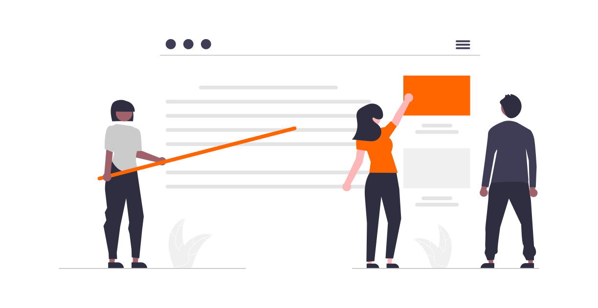

---
hide:
  - toc
---

# Publikationen
Auf dieser Seite sammeln wir **Veröffentlichungen rund um lernOS**. Dazu gehören Artikel, Blogs, Vorträge, Podcasts und Videos. Wenn du noch relevante Quellen kennst, melde dich bei uns oder trage die Links unten in die Kommentare ein.

## 2023
* [Lightning Talk zur lernOS Produktionskette](/blog/2024/01/19/lightning-talk-zur-lernos-produktionskette-auf-dem-37c3/) auf dem 37. Chaos Communication Congress
* Podcast [KCLO108 x Freakshow @ EnBW – Ein Rückblick auf die lernOS Convention 2023](https://cogneon.de/podcast/2023/07/31/kclo108-x-freakshow-enbw-ein-rueckblick-auf-die-lernos-convention-2023/) (öffentliche Version des EnBW-internen Podcasts)
* lernOS Convention 2023 "Crafting Learning Environments" vom 11.-12.07.2023 auf der Kaiserburg Nürnberg und online ([Dokumentation](https://wiki.cogneon.de/LernOS_Convention_2023), [Video](https://www.youtube.com/watch?v=W0UaN3bcmXc&pp=ygUbbG9zY29uMjMgaW1wcmVzc2lvbiBjb2duZW9u))
* Session lernOS 101 & AMA auf dem Expedition Arbeit Barcamp am 29.04.2023 in Fürth (dafür [lernOS Basispräsentation](https://cogneon.github.io/lernos/de-slides) aktualisiert)

## 2022

* Session [Making-of lernOS Convention 2022](https://youtu.be/vPHEhRyjdDI) am 09.09.2022
* Beitrag zur lernOS Convention in der Zeitschrift [wirtschaft+weiterbildung Ausgabe 9/2022](https://www.haufe.de/personal/zeitschrift/wirtschaft-weiterbildung/wirtschaft-weiterbildung-ausgabe-92022-wirtschaft-weiterbildung_48_573890.html) (PDF)
* Interview [Lernen, lernOS, Trends im Corporate Learning und mehr](https://leipzig-hrm-blog.blogspot.com/2022/08/lernen-lernos-trends-im-corporate.html) mit Simon Dückert im Leipziger HRM-Blog
* lernOS Convention 2022 "The Re-Return of Knowledge Management" vom 05.-06.07.2022 auf der Kaiserburg Nürnberg und online ([Dokumentation](https://wiki.cogneon.de/LernOS_Convention_2022), [Video](https://www.youtube.com/watch?v=r9talnVcpYc]))
* Session [#DATEVlernt](https://www.youtube.com/watch?v=yhwNhiOLc4Y) auf der ahrc2022 am 27.04.2022 in Köln
* Blog [Kirche kann/soll/muss lernen!? lernOS und #WOL kann helfen](https://gottdigital.de/kirche-kann-soll-muss-lernen-lernos-und-wol-kann-helfen) vom 23.04.2022
* Video [lernOS - Eine Einführung](https://www.youtube.com/watch?v=JoTjZOK8L2g)
* Blog [Ich brauchte eine Struktur – eine Studentin berichtet aus ihrem lernOS-Zirkel](https://www.fernuni-hagen.de/zli/blog/ich-brauchte-eine-struktur-eine-studentin-berichtet-aus-ihrem-lernos-zirkel/) vom 01.02.2022
* Vorstellung [lernOS Community Management Leitfaden](https://www.youtube.com/watch?v=2CyrFjiXqaM) beim C3Managers Meetup am 20.01.2022
* Freihändig-Podcast Folge 57 [lernOS für Organisationen und Selbstlernprozesse](https://www.oliver-koenig.net/2022/01/13/simon-dueckert-lernos-fuer-organisationen-und-selbstlernprozesse-057/) vom 13.01.2022

## 2021

* [Barcamp DiversityStoryThatMatter]([https://hopin.com/events/diversitystoriesthatmatter) am 10.12. (online)
* Session [ISO 30401 mit dem lernOS für Organisationen Canvas](https://www.youtube.com/watch?v=gv5lynQlWEU) am 19.11.2021 auf dem KnowledgeCamp (#gkc21)
* Session [Making-of lernOS Convention 2021](https://www.youtube.com/watch?v=fk4rz86pahM) am 23.07.2021
* lernOS Convention 2021 "Agil trifft Lernende Organisation" vom 24.-25.06.2021 online ([Dokumentation](https://wiki.cogneon.de/LernOS_Convention_2021), [Video](https://www.youtube.com/watch?v=5v_Gcvdy3no))

## 2020

- Podcast [Lebenslanges Lernen mit lernOS](https://fyyd.de/episode/5173375) im Klartext HR Podcast
- Session [WOL - Back to the Roots](https://www.youtube.com/watch?v=9sCpcEi7uAM) auf dem WOL Camp am 26.11.2020
- Podcast [Lebenslanges Lernen und lernOS](https://wohnzimmer.fm/firmenfunk/ff092-lebenslanges-lernen-und-lernos/) im Firmenfunk Podcast Episode 92 vom 12.11.2020
- [lernOS All Stars Camp](https://wiki.cogneon.de/loscamp20) vom 23.-24.06.2020 (online)
- Vortrag [lernOS in a Nutshell](https://www.youtube.com/watch?v=F5-f61GvXE4) am 15.06.2020 bei der GfWM Regionalgruppe Frankfurt-Rhein-Main
- Video über lernOS for You [auf LinkedIn](https://www.linkedin.com/posts/theresa-laudenbach-4559a5200_lernos-lebenslangeslernen-fau-ugcPost-6770754811093684224-uIA8)
- Gelbe Raben Podcast [Über Wissensmanagement und lernende Organisationen](https://anchor.fm/barbara-brning6/episodes/ber-Wissensmanagement-und-lernende-Organisationen---im-Gesprch-mit-Simon-Dckert-e1elmo0/a-a7esj08) vom 20.02.2022

## 2019

* Vortrag [lernOS - Hacking How We Learn - Lifelong](https://www.youtube.com/watch?v=7atMXYyzkBc) am 30.12.2019 auf dem 36c3 in Leipzig
* Blog [Die 13 wichtigsten Unterschiede zwischen lernOS und WOL](https://cogneon.de/2019/07/13/di3-13-wichtigsten-unterschiede-zwischen-lernos-und-wol/)
* Beitrag [Das Projekt lernOS - Fahrplan fürs ­Lebenslange Lernen](https://www.managerseminare.de/ms_Artikel/Das-Projekt-lernOS-Fahrplan-fuers-Lebenslange-Lernen,272084) in managerSeminare Ausgabe 256
* [lernOS Rockstars Camp](https://community.cogneon.de/t/1-lernos-rockstars-camp/) am 25.06.2019 in München
* Buchkapitel *lernOS als Betriebssystem für die Arbeit der Zukunft* von Simon Dückert in [Faszination New Work: 50 Impulse für die neue Arbeitswelt](https://amzn.to/3issdMx)

## 2018

- Vortrag [lernOS – Lebenslanges Lernen und Aufbau digitaler Kompetenzen für alle Bürger](https://www.youtube.com/watch?v=Wfe7HsqvqrQ) am 18.10.2018 in Erding
- [Release lernOS für Dich Version 1.0](https://www.youtube.com/watch?v=qD8cLcl8g3s) am 18.09.2018
- Blog [lernOS Canvas - A Tool for WOL(TM) Circle Alumni and Knowledge Workers](https://cogneon.de/2018/05/24/wol-a-tool-for-wol-circle-alumni-and-knowledge-workers/) (Umbenennung von WOL+ Canvas in lernOS Canvas)
- Vortrag [Learning Organization - State of the Union - von lernOS, GTD, OKR, PKM, WOL & Co.](https://www.youtube.com/watch?v=H3O3eAY7XrI) am 22.06.2018 auf der KnowTouch in Nürnberg

## 2017

* Session [lernOS - Organisationssystem für lernende Organisationen](https://cogneon.de/2017/10/02/lernos-session-auf-dem-corporate-learning-camp) auf dem Corporate Learning Camp am 29.09.2017 in Frankfurt

## 2016

* Podcast [Cogneon 2.0](https://cogneon.de/2016/12/23/m2p026-cogneon-2-0/) mit einer Aufzeichnung von der 15-Jahres-Feier von Cogneon. Dort haben wir über unsere Vergangenheit und Zukunft gesprochen und das 6-jährige lernOS-Projekt aus der Taufe gehoben.

* [Knowledge Jam #ckj25 Digital Leadership](https://wiki.cogneon.de/Cogneon_Knowledge_Jam/Digital_Leadership_(ckj25)) mit Impulsvortrag zu Working Out Loud von John Stepper und Doppelsession *In Search of a WOL Business Model* in der Cogneon Akademie in Nürnberg
