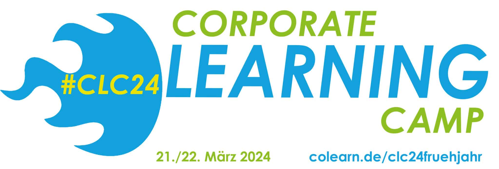

# clc24 Session: lernOS - State of the Union

Auf dem [Corporate Learning Camp 2024](https://colearn.de/clc24fruehjahr/) in Hamburg (#clc24) wird es **am 21.03.2024 von 16:15 - 17:00 Uhr** eine **Session** mit dem Titel "lernOS State of the Union - Wo stehen wir als Community, was sind die nächsten Schritte?" geben. Auditive Teilnahme und Diskussion ist über [dieses Linkedin Audio Event](https://www.linkedin.com/events/lernos-stateoftheunion-wostehen7172162046560456704/comments/) möglich. Die Session wurde als Podcast aufgezeichnet und ist [auf COPOD verfügbar](https://podcasts.cogneon.io/@loa/episodes/lernos-state-of-the-union-session-auf-dem-corporate-learning-camp-2024).

<iframe width="100%" height="112" frameborder="0" scrolling="no" style="width: 100%; height: 112px; overflow: hidden;" src="https://podcasts.cogneon.io/@loa/episodes/lernos-state-of-the-union-session-auf-dem-corporate-learning-camp-2024/embed"></iframe>

<!-- more -->

## Themen der Session

**1.) Ursprung von lernOS**

1. Simon: C64 Community und [Chaos Computer Club](https://www.ccc.de/) (1980er)
1. Öffnung Cogneon Akademie Wiki [COPEDIA](https://wiki.cogneon.de) für alle (2005)
1. [Benchlearning Projekte](https://wiki.cogneon.de/blp) zum Teilen von Wissen über Unternehmensgrenzen hinweg (seit 2012)
1. Cogneon Strategietage zum 15-jährigen Bestehen (2016, s.a. Podcast [Cogneon 2.0](https://cogneon.de/podcast/2016/12/23/m2p026-cogneon-2-0/)), Problem: Know-how und Erfahrungen aus Projekten wie Schaeffler Wissensmanagement, Bosch Praxisleitfaden Wissensmanagement, adidas Learning Campus, Audi Zusammenarbeit 2.0, Siemens Healthineers DigitalTogether uvm. nicht öffentlich sichtbar.
1. Gründung des [lernOS](https://lernos.org) Projekts mit 6-jähriger Laufzeit (2016-2022), 20%-Zeit-Ansatz (Freitags)

**2.) lernOS Leitfäden**

1. Arbeit an [lernOS für Organisationen Leitfaden](https://cogneon.github.io/lernos-for-organizations/de/) ([Session auf dem clc17](https://cogneon.de/2017/10/02/lernos-session-auf-dem-corporate-learning-camp/)), Ebenen-Logik aus dem Wissensmanagement: Individuen, Teams/Gruppen, Organisation
1. Zunehmende Schließung des [WOL-Leitfadens](https://workingoutloud.com) (CC->Copyright, Open Web->Closed) führt zu Arbeit an lernOS für Dich Leitfaden mit Open-Source-Alternative (heute [drei Lernpfade](https://cogneon.github.io/lernos-for-you/de/2-0-Lernpfade/): Offenheit & Vernetzung (WOL), Produktivität & Stressfreiheit (GTD), Fokussierung & Zielorientierung (OKR))
1. Etablierung des [monatlichen Community Calls](https://www.youtube.com/watch?v=-YKT2dD_C10&list=PLsDEDkLIwmRytb196veslnu2JiK9_dTqy), Karl nimmt daran teil und erstellt Sketchnotes zu den Inhalten. Daraus entstand ein Circle, in dem die Erstellung eines lernOS Sketchnoting Leitfadens erstellt wurde
1. Standardisierte Produktionskette für Leitfäden mit Single-Source-Publikation in Verschiedene Zielformate (Web, PDF, E-Book, Word, HTML) und [Github-Template-Repo](https://github.com/cogneon/lernos-template) für schnelles Onboarding von Teams (z.B. in den lernOS Hackathons).
1. Aktuell 13 Leitfäden auf lernos.org veröffentlicht, 4 weitere werden in den nächsten Wochen Veröffentlicht.
1. [lernOS on Air](https://podcasts.cogneon.io/@loa/episodes) (Podcast), davon gibt es monatlich auch die Crossover-Variante "lernOS on Air meets Corporate Learning Podcast", die auch im [Corporate Learning Podcast](https://colearn.de/podcast/) veröffentlicht wird

**3.) lernOS Events, Community & Fallbeispiele**

<iframe width="560" height="315" src="https://www.youtube-nocookie.com/embed/W0UaN3bcmXc?si=mqUbc3a78ZdQ51YW" title="YouTube video player" frameborder="0" allow="accelerometer; autoplay; clipboard-write; encrypted-media; gyroscope; picture-in-picture; web-share" referrerpolicy="strict-origin-when-cross-origin" allowfullscreen></iframe>

1. [lernOS Convention](https://loscon.lernos.org/de/) (früher: lernOS Camp, KnowTouch), jährliches "Familientreffen der Community", hybrid auf der Kaiserburg Nürnberg (Video 2023)
1. [CONNECT Community](https://community.cogneon.de) mit lernOS Bereich, aktuell 1.200+ Mitgliedern.
1. [lernOS KI MOOC](https://www.meetup.com/cogneon/events/297769514/) mit 5 Themenwochen und dem neuen lernOS KI Leitfaden als Basis, man kann als Solo-Lerner:in, im Learning Circle, aber auch mit großen Gruppen in Unternehmen & Organisationen teilnehmen.
1. [lernOS Kernteam](https://github.com/cogneon/lernos-core/wiki#kernteam-treffen) (je 1 Vertreter:in der Leitfäden, Core-Team, Kommunikations-Team, Beiräte, Freiwillige mit Drive)
1. lernOS Fallbeispiele (z.B. DATEV Learning Circle Experience, Continental Learning Circle Experience , SAP Learning Circle Experience, EnBW KI Lernpfad)

<iframe width="560" height="315" src="https://www.youtube-nocookie.com/embed/EOoB-WDLp9U?si=0uRXwfcl5_bOC9P5" title="YouTube video player" frameborder="0" allow="accelerometer; autoplay; clipboard-write; encrypted-media; gyroscope; picture-in-picture; web-share" referrerpolicy="strict-origin-when-cross-origin" allowfullscreen></iframe>

**4.) Feedback, Fragen & Antworten (gerne live oder [über Discord-Chat](https://discord.gg/gT8K9pKqz4))**

Wir bringen natürlich lernOS Merch (Sticker, Stifte etc.) zur Session mit. Ergänzungen, Feedback und Fragen gerne vorab schon unten in die Kommentare eintragen 👇