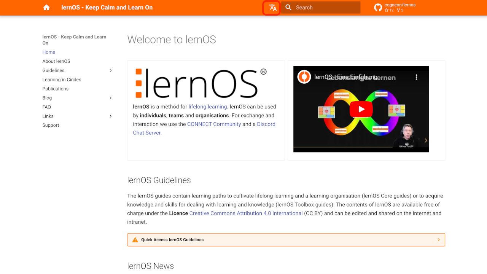

# Die lernOS Website jetzt auch auf Englisch

Wie [im lernOS State of the Union Vortrag angekündigt](https://simondueckert.github.io/presentations/loscon24/#/15/0/1), wollen wir im kommenden Jahr einen Schwerpunkt auf die **Internationalisierung des lernOS Projekts** legen. Dazu gehört neben der mehrsprachigen Verfügbarkeit der Leitfäden natürlich auch die **Website als zentrale Anlaufstelle**.

<!-- more -->

*English version below* 👇

Mit dem [lernOS KI Leitfaden](https://ai.lernos.org/en) hatten wir unsere Produktionskette bereits auf automatische Übersetzung mit [DeepL](https://deepl.com) umgestellt. Den Sprachumschalter findet ihr in der Leiste oben links neben der Suche. Einige Infos zum aktuellen Stand:

1. Die statischen Seiten sind übersetzt.
1. Die Blog-Beiträge veröffentlichen wir in der deutschen Website zweisprachig, damit alle Kommentare an einem Beitrag gebündelt sind.
1. Die einzelnen Seiten zu den Leitfäden in der Navigation unter *Leitfäden* machen wir erstmal in der deutschen Website fertig und übertragen sie dann gesammelt auf die englische Seite.

---

As announced [in the lernOS State of the Union presentation](https://simondueckert.github.io/presentations/loscon24/#/15/0/1), we want to focus on the **internationalisation of the lernOS project** in the coming year. In addition to the multilingual availability of the guides, this naturally also includes the **website as a central point of contact**.

With the [lernOS AI guide](https://ai.lernos.org/en) we had already switched our production chain to automatic translation with [DeepL](https://deepl.com). You can find the language switcher in the bar at the top left next to the search. Some information on the current status:

1. The static pages are translated.
1. We publish the blog posts in two languages on the German website so all comments are bundled under one post.
1. We are finalising the individual pages for the guidelines in the navigation under *Guidelines* on the German website first and then transferring them collectively to the English site.