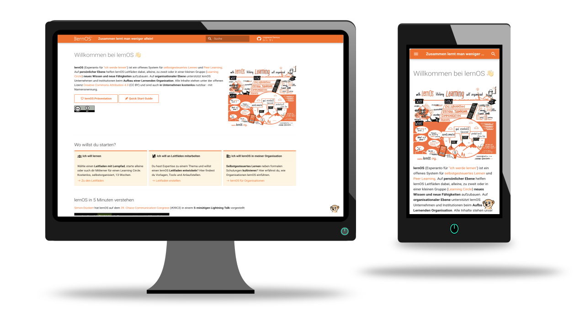

---
date:
  created: 2026-05-18
authors:
  - simondueckert
pin: false
categories:
  - website
  - relaunch
  - mkdocs
---

# lernOS Website in Version 3.0 veröffentlicht

lernOS ist ein Community-Projekt - die Leitfäden und die Convention standen
bisher im Mittelpunkt. Mit der **lernOS Website Version 3.0** bekommt jetzt auch diese die
Aufmerksamkeit, die sie verdient: **klare Zielgruppenansprache**, **neue Seiten**
und ein **Chatbot-Assistent**.

<!-- more -->

**lernos.org** war über die Jahre gewachsen ohne eine klare Struktur für die
drei **Zielgruppen** - Lernende, Leitfaden-Teams und Organisationen. Mit **Version 3.0**
haben wir das grundlegend überarbeitet.

Die **wichtigsten Änderungen** in Kürze:

1. **Startseite:**
   
    - Nach einer kurzen **Einführung** sind direkt die **Präsentation** und der
     **Quick Start Guide** verlinkt.
    - Der "Wo willst du starten?"-Abschnitt führt Besuchende direkt zu
     ihrem **Einstiegspunkt**: Lernen, Mitmachen oder Einführen.
    - Das Lightning Talk **Video** zeigt lernOS in 5 Minuten - ideal für
     alle, die schnell verstehen wollen worum es geht.
    - Der Events-Abschnitt zeigt die **nächsten Termine** und ist per
     [iCal](https://de.wikipedia.org/wiki/ICalendar)-Feed abonnierbar - als Vorbereitung auf die ab Juli
     startenden monatlichen lernOS Meetups.
    - Der Blog-Abschnitt zeigt die drei **neuesten Beiträge** mit [RSS](https://de.wikipedia.org/wiki/RSS_(Web-Feed))-Feed - statt wie
     bisher alle Posts direkt auf der Startseite.
    - Im Bereich "Bleib auf dem Laufenden" sind alle **Community-Kanäle**
     kompakt zusammengefasst.
    - Der Fediverse-Abschnitt erklärt **Mastodon** als digitalsouveräne
     Alternative und zeigt eine **Mastowall** mit dem Hashtag #lernOS -
     passend zum [Digital Independence Day](https://di.day). Wer
     über lernOS postet, wird so direkt auf der Startseite sichtbar.

2. **Neue Detailseiten:**
   
    - **Events:** Infos zu lernOS Convention und lernOS Meetup mit
     der kompletten Veranstaltungshistorie seit 2019.
    - **Leitfaden erstellen:** Erste Basisinfos zur Erstellung neuer
     Leitfäden - mehr folgt in Version 3.1.
    - **Für Organisationen:** Wie lernOS selbstorganisiertes, informelles
     Lernen in Organisationen fördert.
    - **FAQ:** Überarbeitetes Design mit aufklappbaren Antworten.
    - **Bestehende Detailseiten:** werden im nächsten Schritt alle überarbeitet.

3. **Englische Version:**
   
    - Die veraltete englische Version wurde entfernt. Eine **automatisch aktualisierte Übersetzung** folgt sobald die neue Struktur stabil ist.

4. **Suri Chatbot:**
   
    - Am unteren rechten Rand begrüßt dich **Suri** - benannt nach dem
     lernOS Maskottchen, dem Erdmännchen.
    - Der Chatbot ist per **Low/No-Code** mit [n8n](https://n8n.io/) und [Open WebUI](https://docs.openwebui.com/) gebaut.
    - Die **Wissensbasis** von Suri besteht zunächst aus den Inhalten der
     Website, dem RSS-Feed des Blogs und dem iCal-Feed des Kalenders.
    - Als **Sprachmodell** verwenden wir das europäische Modell
     [Mistral Small 4](https://mistral.ai/news/mistral-small-4) über
     Openrouter - bewusst gewählt für digitale Souveränität und
     Inferenz in Europa.

5. **Github Issues** zur kontinuierlichen Verbesserung:
  
    - Die Weiterentwicklung der Website **planen und dokumentieren** wir transparent [in Github Issues](https://github.com/cogneon/lernos/issues).
    - So nutzen wir die **gleiche Infrastruktur**, wie für die Leitfäden, damit ein Wechsel zwischen Arbeit an Leitfäden und Community-Arbeit leicht möglich ist.
    - Für die Zukunft werden wir uns die Möglichkeiten des **Wechsels von Github** zu [Codeberg](https://codeberg.org/) ansehen ([Forgejo](https://forgejo.org/) gehostet von deutschem Verein).

Die Detailseiten werden in den kommenden Wochen mit Version 3.1 weiter
ausgebaut. Feedback gerne als Kommentar hier oder auf CONNECT schreiben.