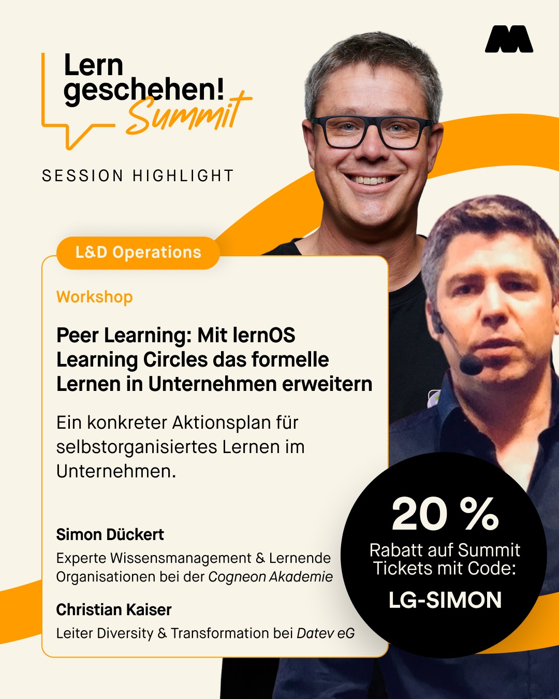

---
date:
  created: 2026-09-15
authors:
  - simondueckert
draft: false
pin: false
categories:
  - lernos
  - lerngeschehen
  - event
  - workshop
---

# lernOS Workshop auf dem Lern geschehen! Summit am 14. Oktober 2026 in Berlin

Es gibt ein "New Kid On The Block" bei den Veranstaltungen zu Personalentwicklung und Weiterbildung: der **Lern geschehen! Summit** von Masterclass - Christian Kaiser und Simon Dückert bieten bei der Premiere des Events einen Workshop zu informellem Lernen mit lernOS an. Für lernOS Community-Mitglieder gibt es Rabatt für die Summit-Teilnahme.

<!-- more -->

Der [Lern geschehen! Summit](https://lern-geschehen.de/) findet vom **14.-15. Oktober 2026** in der [Heeresbäckerei](https://de.wikipedia.org/wiki/Heeresb%C3%A4ckerei) in Berlin Kreuzberg statt. Die neue Veranstaltung richtet sich mit den Themenschwerpunkten Künstliche Intelligenz, Lernmotivation und L&D Operations an Personalentwickler:innen in Organisationen. Das [Programm](https://lern-geschehen.de/programm) besteht aus **Vorträgen, Panels, Impulsen und Workshops**. Mit dabei sind uns bekannte Namen, wie z.B. Cawa Younosi, Judith Muster, Sabine & Alexander Kluge, Nele Graf, Thomas Tillmann und viele mehr.

Mit dabei sind auch [Christian Kaiser](https://www.linkedin.com/in/christian-kaiser-datev/) und ich aus der lernOS Community mit einem **Workshop** mit dem Titel **"Peer Learning: mit lernOS Circles das formelle Lernen in Unternehmen erweitern"**. Wir werden in einem Impuls aufzeigen, wie bestehende Lernarchitekturen in Organisationen um Elemente des informellen Lernens (speziell Peer Learning) erweitert werden können. Dabei teilen wir Erfahrungen aus Learning Circle Experiences (z.B. ) mit Hunderten Learning Circles und stellen die Ergebnisse einer Umfrage zu Erfolgsfaktoren aus dem Frühjahr 2026 vor. Mit dem **Rabattcode "LG-SIMON"** erhaltet ihr 20% Rabatt [beim Ticketkauf](https://lern-geschehen.de/#tickets).

P.S.: wir reisen schon am 13. Oktober an und sind im [Hotel Motel One am Alexanderplatz](https://www.motel-one.com/de/hotels/berlin/hotel-berlin-alexanderplatz/) untergebracht.