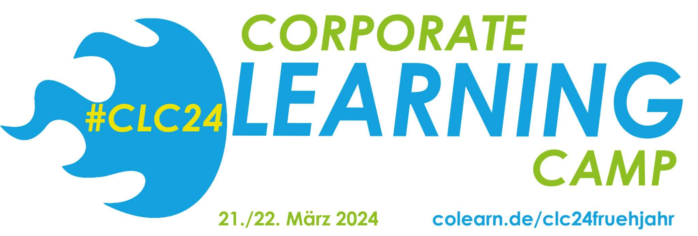

# clc24 Session: lernOS - State of the Union

Auf dem [Corporate Learning Camp 2024](https://colearn.de/clc24fruehjahr/) in Hamburg (#clc24) wird es **am 21.03.2024 von 16:15 - 17:00 Uhr** eine **Session** mit dem Titel "lernOS State of the Union - Wo stehen wir als Community, was sind die nächsten Schritte?" geben. Auditive Teilnahme und Diskussion ist über [dieses Linkedin Audio Event](https://www.linkedin.com/events/lernos-stateoftheunion-wostehen7172162046560456704/comments/) möglich.

<!-- more -->

## Themen der Session

- Ursprung von [lernOS](https://lernos.org)
- [lernOS Leitfäden](https://lernos.org/de/1-guides/)
- [lernOS on Air](https://podcasts.cogneon.io/@loa/episodes) (Podcast)
- lernOS Events
   - [lernOS Community Call](https://community.cogneon.de/t/community-kalender-2024/3868)
   - [lernOS KI MOOC](https://www.meetup.com/cogneon/events/297769514/)
   - [lernOS Convention](https://loscon.lernos.org/de/) (früher: lernOS Camp, KnowTouch)
- lernOS Kernteam
- lernOS Fallbeispiele (z.B. DATEV, Continental, SAP, EnBW)
- Feedback, Fragen & Antworten

Wir bringen natürlich lernOS Merch (Sticker, Stifte etc.) zur Session mit. Ergänzungen, Feedback und Fragen gerne vorab schon unten in die Kommentare eintragen 👇