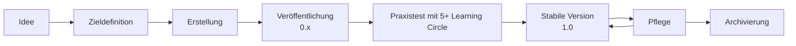

# Einen lernOS Leitfaden erstellen

Ein lernOS Leitfaden hilft Lernenden, in einem **13-wöchigen Learning Sprint** alleine, im Lerntandem oder im Learning Circle (4-5 Personen) neue Kompetenzen aufzubauen. Der Aufwand sollte maximal 2 Stunden pro Woche betragen.

Alle Leitfäden stehen unter der offenen Lizenz [CC BY 4.0](https://creativecommons.org/licenses/by/4.0/deed.de) und werden **als Markdown-Dateien auf GitHub** verwaltet.

---

## Was macht einen guten Leitfaden aus?

Ein lernOS Leitfaden hat immer drei Bereiche:

- **Grundlagen** - theoretischer Hintergrund zum Thema, kompakt und gut verlinkt
- **Lernpfad** - mindestens 11 Übungen (Katas), je 30-60 Minuten, maximal 2 Seiten pro Kata
- **Anhang** - Danksagungen, Änderungshistorie, optionales Glossar

Das Lernziel kann aus einer oder einer Kombination dieser drei Ebenen kommen:

- **Mindset** - eine Haltung entwickeln
- **Skillset** - eine Fähigkeit erlernen
- **Toolset** - ein Tool oder eine Methode beherrschen

---

## Wie startest du?

- :material-numeric-1-circle:{ .lg .middle } **Idee konkretisieren**

    ---

    Wer ist die Zielgruppe? Was sollen Lernende nach 13 Wochen können?
    Gibt es bereits ähnliche Leitfäden?

    Melde dich im [Discord](https://discord.gg/3d6zEnt) und stell deine Idee vor.

- :material-numeric-2-circle:{ .lg .middle } **Vorlage herunterladen**

    ---

    Das lernOS Template Repository enthält alle Vorlagen und Beispiele.
    Lade es als ZIP herunter und entpacke es lokal.

    [:octicons-arrow-right-24: Template Repository](https://github.com/cogneon/lernos-template)

- :material-numeric-3-circle:{ .lg .middle } **Inhalte schreiben**

    ---

    Texte können zunächst in Word oder Google Docs entstehen.
    Das Quellformat für lernOS Leitfäden ist Markdown - die Konvertierung
    kommt am Ende.

    Empfohlener Editor: [MarkText](https://marktext.me/) oder
    [Visual Studio Code](https://code.visualstudio.com)

- :material-numeric-4-circle:{ .lg .middle } **Produktionskette einrichten**

    ---

    Aus den Markdown-Quellen werden automatisch PDF, Word, HTML und
    E-Book generiert. Die Produktionskette läuft lokal oder über
    GitHub Actions in der Cloud.

    [:octicons-arrow-right-24: Anleitung im Template](https://github.com/cogneon/lernos-template)

---

## Lebenszyklus eines lernOS Leitfadens

Ein Leitfaden durchläuft typischerweise diese Phasen:

Solange ein Leitfaden noch nicht in der Praxis getestet wurde, empfehlen wir die Versionsnummer 0.x. Nach einem erfolgreichen Praxistest erhält er die Version 1.0. Idealerweise erscheint der Leitfaden dann in Deutsch und Englisch.

---

## Technische Produktionskette

!!! info "Du musst kein Entwickler sein"

    Die Texterstellung kann in Word oder Google Docs beginnen.
    Die technische Konvertierung in Markdown und die Einrichtung der
    Produktionskette kann im Team aufgeteilt werden - nicht alle müssen
    alles können. Wir empfehlen aber frühzeitig den Leitfaden in Markdown anzulegen und sich damit zu beschäftigen, um Mehraufwand am Ende zu vermeiden.

Die Produktionskette verwendet folgende Tools:

- **[Markdown](https://de.wikipedia.org/wiki/Markdown)** als Quellformat für die Texterstellung (Empfohlener Editor: [MarkText](https://marktext.me/))
- **[GitHub](https://de.wikipedia.org/wiki/GitHub)** zur Versionsverwaltung und Veröffentlichung ([Github Desktop](https://desktop.github.com/download/) für lokales Arbeiten)
- **[Pandoc](https://pandoc.org/)** zur Konvertierung in PDF, Word, HTML, E-Book
- **[mkdocs](https://www.mkdocs.org/)** zur Erstellung der Webversion
- **[mkdocs material](https://squidfunk.github.io/mkdocs-material/)** als Theme der Webversion
- **[GitHub Actions](https://docs.github.com/en/actions)** für die automatische Generierung in der Cloud

Eine detaillierte Anleitung findest du im
[lernOS Template Leitfaden](https://github.com/cogneon/lernos-template).

---

## Fragen und Unterstützung

- **Discord** `#lernos` - schnelle Fragen und Abstimmung