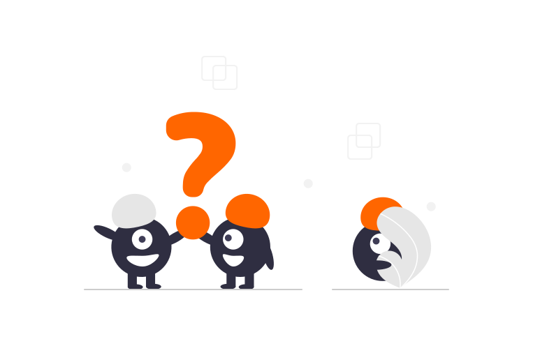

---
hide:
  - toc
---

# lernOS FAQ
Auf dieser Seite sammeln wir die **Antworten zu oft gestellten Fragen**. Ist Deine Frage nicht dabei, kannst du sie unten in die Kommentare schreiben.

**Ich möchte in lernOS einsteigen, weiß aber noch nicht genau wie. Welche Tipps gibt es?**

Eine gute Anlaufstelle ist die [Community CONNECT](https://community.cogneon.de) mit über 1.600 Mitgliedern und dem monatlichen Community Call. Um die Termine mitzubekommen, kannst Du Dich einfach in unserer [Gruppe auf Meetup](https://www.meetup.com/lernos-connect/) anmelden. Außerdem kannst in den sozialen Medien wie z.B. Twitter oder LinkedIn herumfragen (Hashtag: #lernos). Wenn Du ein Lerntandem oder eine Lerngruppe starten möchtest, empfehlen wir Dir den [Peerfinder](https://web.peerfinder.app/).

**Wo finde ich die PDF-, Word- und E-Book-Dateien zu den Leitfäden?**

Klicke in der Web-Version des Leitfadens in der Seitenleiste links auf *Downloads*. Wenn sie dort nicht verlinkt sind, kannst du es oben mit dem direkten Link zum GitHub-Repository probieren. Dort findest du die Dateien im Ordner zur jeweiligen Sprachversion (z.B. de, en).

**Kann ich die lernOS Leitfäden auf einem E-Book-Reader wie dem Kindle lesen?**

Ja. Die Leitfaden sind in den E-Book-Formaten [EPUB](https://de.wikipedia.org/wiki/EPUB) und [Mobipocket](https://de.wikipedia.org/wiki/Mobipocket) verfügbar. Beim Kindle musst du z.B. die mobi-Datei an die E-Mail-Adresse des Kindle schicken (wird in den Einstellungen angezeigt). Bei E-Book-Management-Software wie [Calibre](https://calibre-ebook.com/) kann die epub-Datei einfach per Drag&Drop hinzugefügt werden.

**Kann ich lernOS Inhalte benutzen und modifizieren?**

Ja, Du kannst und wir wollen sogar, dass du das machst! Aus diesem Grund werden die Inhalte von lernOS unter der Lizenz [Creative Commons Namensnennung 4.0 International](https://creativecommons.org/licenses/by/4.0/deed.de) (CC BY) veröffentlicht. Du kannst die Inhalte herunterladen, benutzen und modifizieren. Du kannst lernOS Inhalte im privaten und kommerziellen Kontexten kostenfrei verwenden.

**Was ist der Unterschied zwischen lernOS und anderen Methoden wie z.B. Working Out Looud (WOL)?**

Siehe [Blog zu den wichtigsten Unterschieden](https://cogneon.de/2019/07/13/di3-13-wichtigsten-unterschiede-zwischen-lernos-und-wol/).

**Kann ich kommerzielle Produkte und Dienstleistungen mit lernOS im Namen anbieten?**

Nein. Einzelne Produkte und Dienstleistungen dürfen den Begriff "lernOS" nicht in ihrem Namen enthalten (z.B. "lernOS Lernwerkstatt"). Das ist wie bei Open Source Webbrowser [Chromium](https://www.chromium.org/Home), dessen Quellcode jeder verwenden kann. Darauf aufbauende Produkte müssen aber einen anderen Namen haben ([Google Chrome](https://de.wikipedia.org/wiki/Google_Chrome), [Microsoft Edge](https://de.wikipedia.org/wiki/Microsoft_Edge), [Opera](https://de.wikipedia.org/wiki/Opera_(Browser)), [Flock](https://de.wikipedia.org/wiki/Flock_(Browser)), [Brave](https://de.wikipedia.org/wiki/Brave_(Browser))).

**Ich möchte selber einen lernOS Leitfaden erstellen, wie geht das?**
Die Erstellung von lernOS Leitfäden wird im [lernOS Template Leitfaden](https://cogneon.github.io/lernos-template/de/) beschrieben. Wenn du einen Leitfaden schreiben willst, nimm am besten als ersten Schritt Kontakt mit [Simon Dückert](https://www.linkedin.com/in/simondueckert/) auf.
