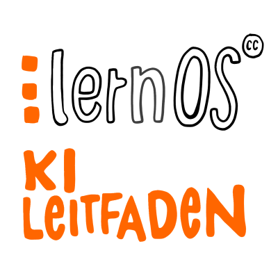

# lernOS KI Leitfaden

!!! Hinweis

    Der lernOS KI Leitfaden wird vom **6.5. - 21.6.** im [lernOS KI MOOC](https://loscon.lernos.org/de/kimooc24/) getestet. Die Erfahrungen tragen wir am **2./3. Juli 2024** in der [lernOS Convention](https://loscon.lernos.org/de/) zusammen.
    
Der [**lernOS KI Leitfaden**](https://ai.lernos.org/de/) führt Menschen **ohne KI-Vorbildung** an das Thema [Künstliche Intelligenz](https://de.wikipedia.org/wiki/K%C3%BCnstliche_Intelligenz) und insbesondere die [Generative KI](https://en.wikipedia.org/wiki/Generative_artificial_intelligence) heran. Sie können mit dem Lernpfad eine **informierte Entscheidung** treffen, ob und wie sie betroffen sind und welchen **Nutzen** sie durch Generative KI haben könnten. Der Leitfaden kann mit **KI-Tools innerhalb und außerhalb von Organisationen** verwendet werden (im Internet z.B. ChatGPT, im Intranet z.B. Microsoft Copilot).

# Zielgruppe
Der lernOS KI Leitfadens richtet sich an die **Menschen**, die **"vor der Mattscheibe"** sitzen, **nicht an KI-Entwickler:innen**. Anwender:innen sollen aber Hintergründe Generativer KI verstehen. Der Lernpfad kann **alleine**, **im Lerntandem** oder im **Learning Circle** durchlaufen werden. **Pro Kata** sind ca. **1-2 Stunden** Zeit notwendig.

# Inhalt
- Generative KI, Maschinelles Lernen und künstliche, neuronale Netze
- Typische Anwendungsfelder Generativer KI
- KI-Modelle, -Tools und -Dienste
- Promting, Promt Engineering
- Generative KI und deren gesellschaftlichen Auswirkungen

# Links
- Webversion [lernOS KI Leitfaden](https://ai.lernos.org/de/) (weitere Version wie PDF sind dort in der Navigation unter *Download* verlinkt)
- Kategorie [lernOS Künstliche Intelligenz auf CONNECT](https://community.cogneon.de/c/lernos/lernos-kuenstliche-intelligenz/76) für Fragen, Diskussion und Erfahrungsaustausch

# Testimonials
>   "Hier könnte Dein Zitat stehen" (und hier Dein Name) 😉

# Aktuelles Leitfaden-Team (alphabetisch)
1. [Benedikt Scheerer](https://www.linkedin.com/in/benedikt-scheerer-6020ba18/)
1. [Doris Schuppe](https://www.linkedin.com/in/doschu/)
1. [Ellen Braun](https://www.linkedin.com/in/ellen-braun-work-and-feelgood/)
1. [Hans Gaertner](https://www.linkedin.com/in/hgaertner/)
1. [Marcel Kirchner](https://www.linkedin.com/in/marcelkirchner/)
1. [Moritz Meissner](https://www.linkedin.com/in/moritz-meissner/)
1. [Oliver Ewinger](https://www.linkedin.com/in/oliver-ewinger/)
1. [Oliver Pincus](https://www.linkedin.com/in/oliverpincus/)
1. [Simon Dückert](https://www.linkedin.com/in/simondueckert/) (Maintainer)
1. [Simon Roderus](https://www.linkedin.com/in/simon-roderus/)
1. [Stefan Strobel](https://www.linkedin.com/in/stefan-strobel-haiilo/)
1. [Susann Schulz](https://www.linkedin.com/in/susannschulz/)
1. [Thomas Küll](https://www.linkedin.com/in/thomas-k%C3%BCll-46a5b1162/)
1. [Tilo Eissmann](https://www.linkedin.com/in/tilo-ei%C3%9Fmann-09a58369/)
1. [Ute Reichert](https://www.linkedin.com/in/ute-reichert-6945141a3/)