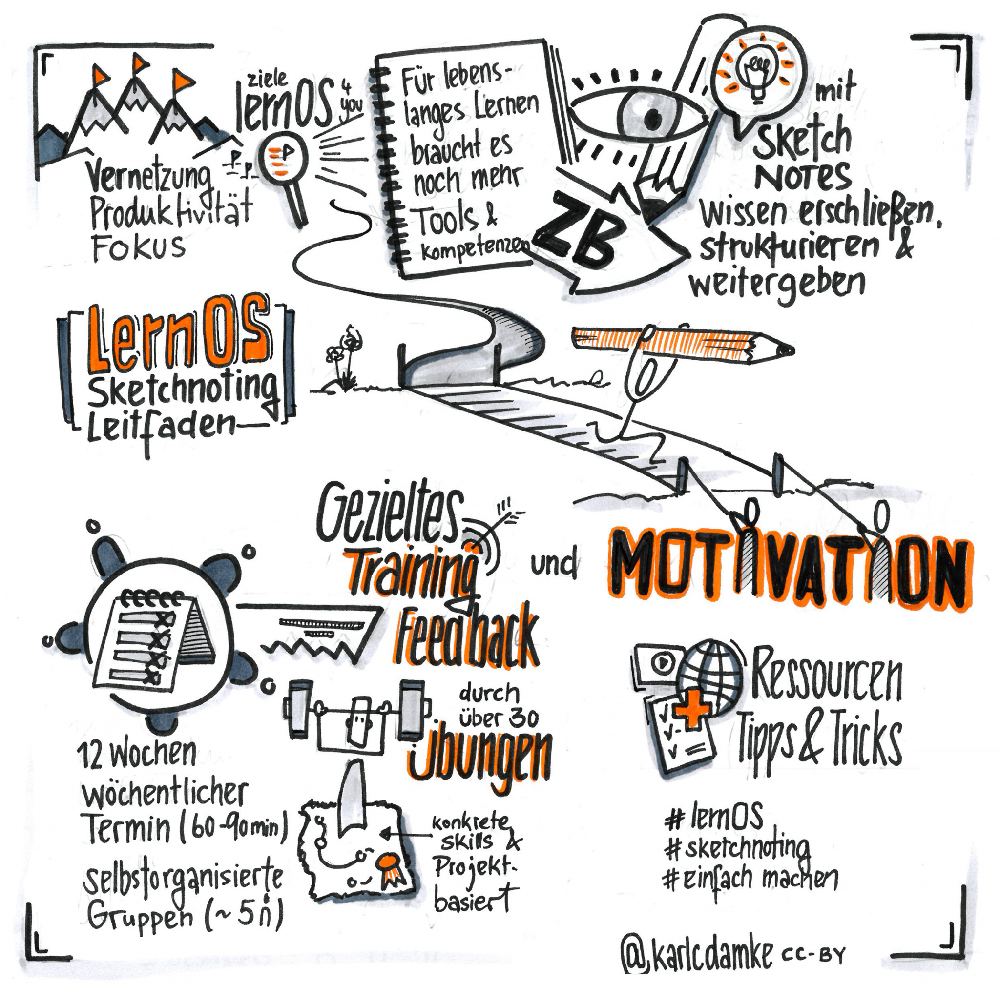

# lernOS Sketchnoting Leitfaden

Mit dem **lernOS Sketchnoting Leitfaden** findest du in 12 Wochen deinen Zugang zu Sketchnotes, visuellen Notizen oder du verbesserst deine Sketchnote-Skills gemeinsam mit anderen Sketchnote-Enthusiasten. Also: Keep Calm & Sketch On!

[lernOS Sketchnoting Leitfaden](https://cogneon.github.io/lernos-sketchnoting/de/){ .md-button .md-button--primary }

## Zielgruppe
Der lernOS Sketchnoting Leitfaden richtet sich an Menschen, die sich für visuelle Notizen interessieren - egal ob für den privaten Einsatz oder den Einsatz im Unternehmen. Der Lernpfad funktioniert für alle “Level”, egal ob du erst seit 5 Minuten oder schon seit 5 Jahren Sketchnotes (visuelle Notizen) erstellst.  Der Lernpfad kann im **Learning Circle** durchlaufen werden. **Pro Kata** sind ca. **1-2 Stunden** Zeit notwendig.

## Inhalt
- Einführung ins Sketchnoting & Wissen zu Material und Grundlagen
- Mit Sketchnotes (visuellen Notizen) Wissen erschließen, strukturieren & weitergeben
- Schrift und Lesbarkeit
- Struktur und Verständlichkeit
- Visuelles Vokabular
- Live visualisierern
- Ressourcen zum Weiterlernen, Vernetzen und Inspirieren lassen

## Links
- Webversion [lernOS KI Leitfaden](https://ai.lernos.org/de/) (weitere Version wie PDF sind dort in der Navigation unter *Download* verlinkt)
- Website [lernos-sketchnoting.net](https://lernos-sketchnoting.net/)

## Testimonials
>   Der Austausch mit Gleichgesinnten war so wertvoll und hat so viel Spaß gemacht:
>
>   (Telse Ahrweiler)

---

>   Es war eine schöne Zeit. Wir haben es während Corona online durchgeführt und obwohl wir oft recht energielos in unsere Termine gingen, kamen wir vollgetankt und inspiriert wieder raus. Kreativität tat uns allen sehr gut in dieser Zeit der Isolation. Auch wenn wir uns erstmal aufraffen mussten. Der Leitfaden war ein toller Anlass und eine sehr gute Hilfe, sich dem Thema Sketchnotes zu nähern und tiefer einzusteigen.
>
>   (Mica Jacobs)

---

>   2018 wusste ich nicht, was eine Sketchnote ist. Heute kann ich mir ein Leben ohne
Sketchnotes nicht mehr vorstellen, und ich bin gespannt, was in den kommenden Jahren noch alles passieren wird. Sketchnotes haben mein Leben verändert und die Entscheidung, den lernOS Circle zu machen, gehört im Nachhinein betrachtet zu den besten Entscheidungen meines Lebens.
>
>   (Maria Steinberg)

## Aktuelles Leitfaden-Team (alphabetisch)
1. Lars Bartschat
1. Katharina Bluhm
1. Karl Damke
1. Benjamin Krüger
1. Katrin Mäntele (Maintainer)
1. Raffaelina Rossetti
1. Marjukka Zsagar-Renneberg
