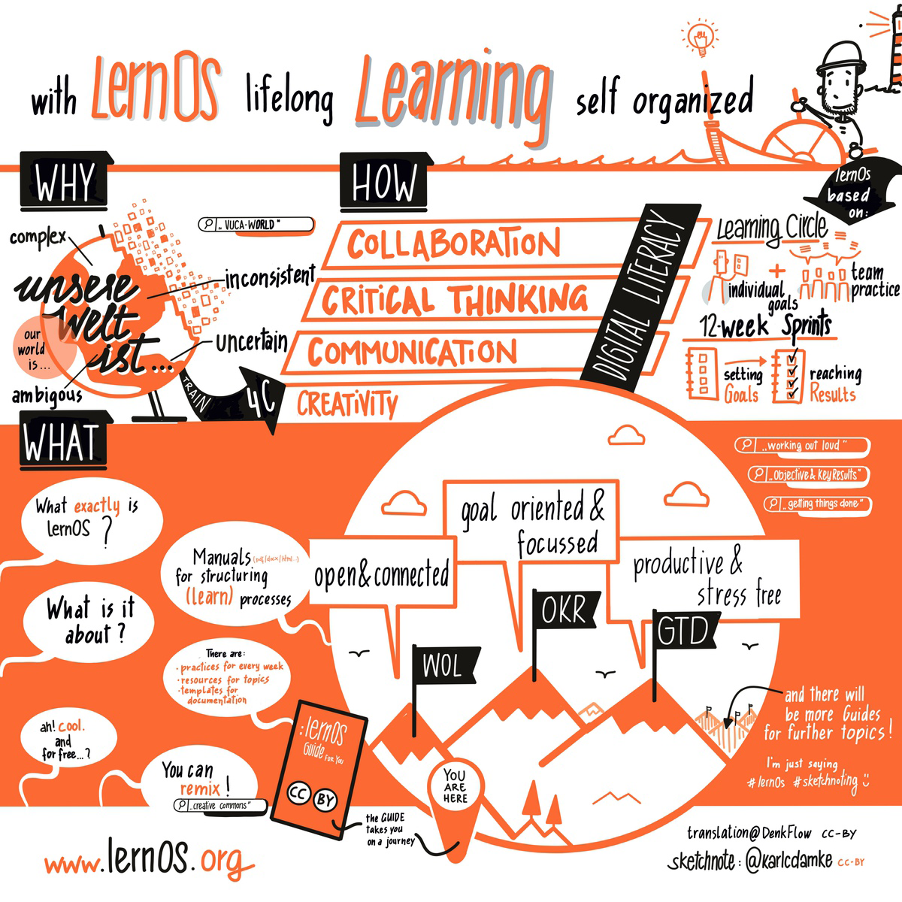

---
hide:
  - toc
---

 

**Zusammen lernt man weniger allein!** [Peer Learning](https://en.wikipedia.org/wiki/Peer_learning) unterstützt Menschen dabei, gemeinsam lebenslang zu lernen. Häufig verwendete Formate sind [Barcamps](https://de.wikipedia.org/wiki/Barcamp), [Stammtische & Meetups](https://en.wikipedia.org/wiki/Meeting), [Hackathons](https://de.wikipedia.org/wiki/Hackathon), [Communities of Practice](https://de.wikipedia.org/wiki/Community_of_Practice) (CoPs), [Massive Open Online Courses](https://de.wikipedia.org/wiki/Massive_Open_Online_Course) (MOOCs), [Mastermind Gruppen](https://en.wikipedia.org/wiki/Mastermind_group) und [Learning Circles](https://en.wikipedia.org/wiki/Learning_circle). Das Projekt **lernOS** stellt die offen und kostenlos verfügbaren [lernOS Leitfäden](1-guides.md) zur Verfügung, um Einzelpersonen und Lerngruppen beim [selbstgesteuerten Lernen](https://de.wikipedia.org/wiki/Selbstgesteuertes_Lernen) zu unterstützen.

## lernOS Blog

Dem **lernOS Blog** kannst du auch mit dem [RSS-Feed](https://lernos.org/de/feed_rss_created.xml) folgen - wer keinen Feedreader hat, kann [NewNewsWire](https://netnewswire.com/) für iOS oder [Flym](https://github.com/FredJul/Flym) für Android probieren. Wir informieren außerdem über die [Linkedin-Seite](https://www.linkedin.com/showcase/lern-os), den [Linkedin-Newsletter](https://www.linkedin.com/newsletters/lernos-news-7305595387040456705/) und unter [@lernos](https://colearn.social/@lernos) auf **Mastodon**. Außerdem gibt es noch den [lernOS on Air Podcast](https://podcasts.cogneon.io/@loa) ([Podcast-Feed](https://podcasts.cogneon.io/@loa/feed.xml), [Spotify](https://open.spotify.com/show/4K9CueTvOFcrAQGIyKtwRp)), die [Meetup-Gruppe der Cogneon Akademie](https://www.meetup.com/cogneon/) **für Terminankündigungen** und die [CONNECT Community](https://community.cogneon.de/categories) **für Austausch und Diskussion**.