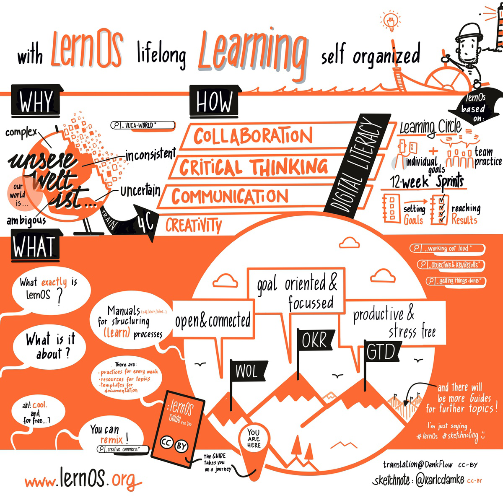

---
hide:
  - toc
  - navigation
---
# Willkommen bei lernOS 👋

{ align=right width=400 .lernos-image }

**lernOS** (Esperanto für ["ich werde lernen"](https://en.wiktionary.org/wiki/lernos)) ist ein offenes System für [selbstgesteuertes Lernen](https://de.wikipedia.org/wiki/Selbstgesteuertes_Lernen) und [Peer Learning](https://en.wikipedia.org/wiki/Peer_learning). Auf **persönlicher Ebene** helfen lernOS Leitfäden dabei, alleine, zu zweit oder in einer kleinen Gruppe ([Learning Circle](learning-circles.md)) **neues Wissen und neue Fähigkeiten** aufzubauen. Auf **organisationaler Ebene** unterstützt lernOS Unternehmen und Institutionen beim **Aufbau einer Lernenden Organisation**. Alle Inhalte stehen unter der offenen Lizenz [Creative Commons Attribution 4.0](https://creativecommons.org/licenses/by/4.0/deed.de) (CC BY) und sind auch **in Unternehmen kostenlos** nutzbar - mit Namensnennung.

[:material-presentation: lernOS Präsentation](https://lernos.org/de-slides){ .md-button } [:material-rocket-launch: Quick Start Guide](images/lernOS-Quick-Start-Guide-de-v03.pdf){ .md-button }

---

## Wo willst du starten?

- :material-account-group:{ .lg .middle } **Ich will lernen**

    ---

    Wähle einen **Leitfaden mit Lernpfad**, starte alleine oder such dir Mitlerner für einen Learning Circle. Kostenlos, selbstorganisiert, 13 Wochen.

    [:octicons-arrow-right-24: Zu den Leitfäden](guides.md)

- :material-book-edit:{ .lg .middle } **Ich will an Leitfäden mitarbeiten**

    ---

    Du hast Expertise zu einem Thema und willst einen lernOS **Leitfaden entwickeln**? Hier findest du Vorlagen, Tools und Anlaufstellen.

    [:octicons-arrow-right-24: Leitfaden erstellen](create-guide.md)

- :material-domain:{ .lg .middle } **Ich will lernOS in meiner Organisation**

    ---

    **Selbstgesteuertes Lernen** neben formalen Schulungen **kultivieren**? Hier erfährst du, wie Organisationen lernOS einführen.

    [:octicons-arrow-right-24: lernOS für Organisationen](for-organizations.md)

---

## lernOS in 5 Minuten verstehen

[Simon Dückert](https://www.linkedin.com/in/simondueckert/) hat lernOS auf dem [39. Chaos Communication Congress](https://media.ccc.de/c/39c3) (#39C3) in einem **5-minütigen Lightning Talk** vorgestellt:

<iframe width="560" height="315" src="https://www.youtube-nocookie.com/embed/0Hi9myfpJEw?si=YEmG--x4_g36a26F" title="YouTube video player" frameborder="0" allow="accelerometer; autoplay; clipboard-write; encrypted-media; gyroscope; picture-in-picture; web-share" referrerpolicy="strict-origin-when-cross-origin" allowfullscreen></iframe>

---

## lernOS Events

Die **lernOS Community** trifft sich regelmäßig - monatlich beim **lernOS Meetup** in Präsenz, online und hybrid - und einmal im Jahr bei der **lernOS Convention** (loscon). Alle Termine auf einen Blick:

<iframe frameborder="0" height="500px" width="100%" src="https://kalender.digital/0b0b376e6e880459954a?iframe=true"></iframe>

[:material-calendar: Alle Events und Infos](events.md){ .md-button } [:material-calendar-export: Kalender abonnieren (.ics)](https://export.kalender.digital/ics/6650391/36fea8076648f909efcc/lernostermine.ics?past_months=3&future_months=36){ .md-button }

---

## Akutell im lernOS Blog

<em>Lade aktuelle Beiträge...</em>

[:octicons-arrow-right-24: Alle Blog-Beiträge](blog/index.md){ .md-button }

---

## Lass uns vernetzen!

- :fontawesome-brands-mastodon:{ .lg .middle } **Mastodon**

    ---

    Neuigkeiten, Lernimpulse und Terminankündigungen im Fediverse.

    [:octicons-arrow-right-24: @lernos@colearn.social](https://colearn.social/@lernos)

- :fontawesome-brands-linkedin:{ .lg .middle } **LinkedIn**

    ---

    Neuigkeiten, Lernimpulse, Terminankündigungen und der monatliche lernOS Newsletter.

    [:octicons-arrow-right-24: LinkedIn-Seite](https://www.linkedin.com/showcase/lern-os)
    [:octicons-arrow-right-24: Newsletter](https://www.linkedin.com/newsletters/lernos-news-7305595387040456705/)

- :material-forum:{ .lg .middle } **CONNECT Community**

    ---

    Fragen, Ideen, Erfahrungsaustausch und Diskussion mit anderen Lernenden.

    [:octicons-arrow-right-24: Zur Community](https://community.cogneon.de/c/lernos/73)

- :material-podcast:{ .lg .middle } **lernOS on Air Podcast**

    ---

    Neuigkeiten und Geschichten aus der Welt der lernOS Community.

    [:octicons-arrow-right-24: Zum Podcast](https://podcasts.cogneon.io/@loa)
    [:octicons-arrow-right-24: Spotify](https://open.spotify.com/show/4K9CueTvOFcrAQGIyKtwRp)

- :simple-rss:{ .lg .middle } **RSS**

    ---

    Blog-Beiträge direkt in deinen Feedreader. Empfehlung: NetNewsWire (iOS/Mac) oder Flym (Android).

    [:octicons-arrow-right-24: RSS-Feed](https://lernos.org/de/feed_rss_created.xml)

- :fontawesome-brands-discord:{ .lg .middle } **Discord**

    ---

    Zusammenarbeit der Leitfaden-Teams und Projektkoordination.

    [:octicons-arrow-right-24: Discord beitreten](https://discord.gg/3d6zEnt)

## lernOS News aus dem Fediverse

Die lernOS Community ist auch im [Fediverse](https://de.wikipedia.org/wiki/Fediverse) aktiv - teile deine Lernerfahrungen
mit dem Hashtag **#lernOS** auf [Mastodon](https://de.wikipedia.org/wiki/Mastodon_(soziales_Netzwerk)). Wir empfehlen [colearn.social](https://colearn.social), die Instanz der [Corporate Learning Community](https://colearn.de) für alle, die rund um Lernen und Wissensmanagement vernetzt sein wollen (Tipp: Booklet [Fediverse. So geht Social Media - Raus aus den Hassmedien](https://pub.uni-bielefeld.de/download/2966158/2966159/kum_16_free.pdf) (PDF) von [digitalcourage](https://digitalcourage.de/)).

[:fontawesome-brands-mastodon: Konto auf colearn.social anlegen](https://colearn.social/auth/sign_up){ .md-button }
[:octicons-arrow-right-24: @lernos folgen](https://colearn.social/@lernos){ .md-button }

<iframe 
    src="https://cogneon.github.io/mastowall/?hashtags=lernos%2Closcon26&server=https%3A%2F%2Fcolearn.social"
    width="100%" 
    height="800px" 
    frameborder="0"
    scrolling="yes">
</iframe>
