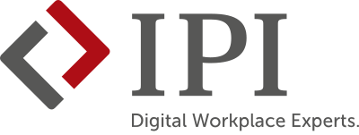

---
hide:
  - toc
---

 

**Zusammen lernt man weniger allein!** [Peer Learning](https://en.wikipedia.org/wiki/Peer_learning) unterstützt Menschen dabei, gemeinsam lebenslang zu lernen. Häufig verwendete Formate sind [Barcamps](https://de.wikipedia.org/wiki/Barcamp), [Stammtische & Meetups](https://en.wikipedia.org/wiki/Meeting), [Hackathons](https://de.wikipedia.org/wiki/Hackathon), [Communities of Practice](https://de.wikipedia.org/wiki/Community_of_Practice) (CoPs), [Massive Open Online Courses](https://de.wikipedia.org/wiki/Massive_Open_Online_Course) (MOOCs), [Mastermind Gruppen](https://en.wikipedia.org/wiki/Mastermind_group) und [Learning Circles](https://en.wikipedia.org/wiki/Learning_circle). Das Projekt **lernOS** stellt [offen](https://opendefinition.org/od/2.0/de/) verfügbare Lernpfade und Leitfäden zur Verfügung, um Einzelpersonen und Lerngruppen beim [selbstgesteuerten Lernen](https://de.wikipedia.org/wiki/Selbstgesteuertes_Lernen) zu unterstützen.

[lernOS Community](https://community.cogneon.de/categories){ .md-button .md-button--primary }
[lernOS @ Linkedin](https://www.linkedin.com/showcase/lern-os){ .md-button }
[lernOS @ Mastodon](https://colearn.social/@lernos){ .md-button }

## Peer Learning Quickstarter
Von der Schule, der Ausbildung, der Hochschule und der Weiterbildung in Organisationen und Unternehmen sind wir gewohnt, dass andere uns **Lerneinheiten** (z.B. Schulungen, Seminare, E-Learnings) mit vorgegebenen **Lernzielen** und **Lerninhalten** vorgeben (fremdgesteuertes Lernen, auch [instructor-led training](https://en.wikipedia.org/wiki/Peer_learning)). Das ist bequem, passt aber nicht immer zu den Anforderungen. Die ersten Schritte ins selbstgesteuerte Lernen fühlen sich sicher etwas ungewohnt an. Hier ein paar Tipps für den Einstieg:

:fontawesome-solid-bullseye: Welche **Lernziele** hast du, die du durch fremdgesteuertes Lernen nicht oder nicht gut erreichst? Schreibe sie auf.

:fontawesome-solid-calendar-days: Welches der Lernziele willst du **im nächsten Quartal** erreichen? Wie viel Zeit kannst/willst du investieren? Gib dem Ziel die Priorität 1.

:fontawesome-solid-book: Gibt es zur Erreichung des Lernziels schon einen **Lernpfad**, z.B. in Form eines **lernOS Leitfadens** (s.u.) oder einer anderen offenen Lern-Ressource ([Open Educational Ressource](https://de.wikipedia.org/wiki/Open_Educational_Resources))?

:fontawesome-solid-people-group: Möchtest du **alleine**, im **Lerntandem** (zu zweit) oder in einem **Learning Circle** (mit 3-5 Personen) lernen? Hast du schon Mitlernende? Wenn nicht, nutze soziale Netzwerke wie Linkedin, Mastodon, Viva Engage & Co. oder Tools wie den Peerfinder, um eine Lerngruppe zu bilden

:fontawesome-solid-lightbulb: **Tipp:** wenn du gar nicht weißt, wo du anfangen sollst, suche dir 3-4 Mitlernende und startet einen **Learning Circle** [mit einem der drei Lernpfade](https://4you.lernos.org/de/2-0-Lernpfade/) aus dem **lernOS für Dich Leitfaden** ([Getting Things Done](https://de.wikipedia.org/wiki/Getting_Things_Done) für stressfreie Produktivität, [Objectives & Key Results](https://de.wikipedia.org/wiki/Objectives_and_Key_Results) für Zielorientierung & Fokussierung, [Working Out Loud](https://de.wikipedia.org/wiki/Working_out_loud) für offenes & vernetztes Lernen und Arbeiten).

:fontawesome-solid-rocket: Viel Erfolg - **Keep Calm & Learn On** - Lifelong!

## Schnellzugriff lernOS Leitfäden

Die [lernOS Leitfäden](1-guides.md) stellen **Lernpfade** bereit, die euch beim selbstorganisierten Lernen alleine oder in Gruppen unterstützen. Die Lernpfade sind in der Regel so ausgelegt, dass sie **innerhalb eines Quartals** (12 Wochen) mit **ca. 2 Stunden Zeitaufwand pro Woche** gemeistert werden können. Die Leitfäden bestehen immer aus einem **Grundlagen-Kapitel** und einem oder mehreren **Lernpfaden** mit den **Übungen** (bei lernOS [Katas](https://de.wikipedia.org/wiki/Kata_(Programmierung)) genannt) für die einzelnen Wochen.

Für **Einsteiger:innen** empfiehlt sich der **lernOS für Dich Leitfaden**, um eine der **drei Methoden** [Getting Things Done](https://de.wikipedia.org/wiki/Getting_Things_Done) (Lernpfad Produktivität und Stressfreiheit), [Objectives & Key Results](https://de.wikipedia.org/wiki/Objectives_and_Key_Results) (Lernpfad Zielorientierung & Fokussierung) oder [Working Out Loud](https://de.wikipedia.org/wiki/Working_out_loud) (Lernpfad Offenheit & Vernetzung) zu erlernen:

[lernOS für Dich](https://4you.lernos.org){ .md-button .md-button--primary }

[Lernpfad Produktivität und Stressfreiheit (GTD)](https://4you.lernos.org/de/2-1-0-Lernpfad-PS/){ .md-button }

[Lernpfad Objectives & Key Results (OKR)](https://4you.lernos.org/de/2-2-0-Lernpfad-ZF/){ .md-button }

[Lernpfad Working Out Loud (WOL)](https://4you.lernos.org/de/2-3-0-Lernpfad-OV/){ .md-button }

**Weitere Methoden** könnt ihr mit den **Leitfäden** aus der **lernOS Toolbox** erlernen:

[lernOS Achtsamkeit](https://cogneon.github.io/lernos-achtsamkeit/de/){ .md-button .md-button--primary }
[lernOS Barcamp](https://cogneon.github.io/lernos-achtsamkeit/de/){ .md-button .md-button--primary }
[lernOS Community Management](https://cogneon.github.io/lernos-cmgmt/de/){ .md-button .md-button--primary }

[lernOS Content Curation](https://cogneon.github.io/lernos-content-curation/de/){ .md-button .md-button--primary }
[lernOS Digitale Zusammenarbeit](https://cogneon.github.io/lernos-digitale-zusammenarbeit/de/){ .md-button .md-button--primary }
[lernOS Digitales Ökosystem](https://cogneon.github.io/lernos-digitales-oekosystem/de/){ .md-button .md-button--primary }

[lernOS Diversity & Inclusion](https://cogneon.github.io/lernos-diversity/de/){ .md-button .md-button--primary }
[lernOS ePortfolio](https://cogneon.github.io/lernos-eportfolio/de/){ .md-button .md-button--primary }
[lernOS Expert Debriefing](https://cogneon.github.io/lernos-expert-debriefing/de/){ .md-button .md-button--primary }

[lernOS Künstliche Intelligenz](https://ai.lernos.org/){ .md-button .md-button--primary }
[lernOS Podcasting](https://cogneon.github.io/lernos-podcasting/de/){ .md-button .md-button--primary }
[lernOS Problemlösen](https://cogneon.github.io/lernos-podcasting/de/){ .md-button .md-button--primary }

[lernOS Prozessmodellierung](https://cogneon.github.io/lernos-prozessmodellierung/de/){ .md-button .md-button--primary }
[lernOS Sketchnoting](https://cogneon.github.io/lernos-prozessmodellierung/de/){ .md-button .md-button--primary }
[lernOS Zettelkasten](https://cogneon.github.io/lernos-zettelkasten/de/){ .md-button .md-button--primary }

**Hinweis:** Die Inhalte aller Leitfäden stehen **kostenfrei** unter [Creative Commons Namensnennung 4.0 International Lizenz](https://creativecommons.org/licenses/by/4.0/deed.de) (CC BY) zur Verfügung, sie können (und sollen) im **Internet und Intranet** gerne **geteilt und bearbeitet** werden.

## lernOS News
Es gibt mehrere **Kanäle**, um über lernOS **auf dem Laufenden** zu bleiben. Folgt uns, abonniert uns und teilt die Botschaft in euren Netzwerken:

:fontawesome-solid-rss: [lernOS Blog](blog/index.md) mit [RSS-Feed](https://lernos.org/de/feed_rss_created.xml) (wer keinen Feedreader hat, kann [NewNewsWire](https://netnewswire.com/) für iOS oder [Flym](https://github.com/FredJul/Flym) für Android probieren).

:material-linkedin: [Linkedin-Seite](https://www.linkedin.com/showcase/lern-os) mit [lernOS Events](https://www.linkedin.com/showcase/lern-os/events/) und [lernOS Newsletter](https://www.linkedin.com/newsletters/lernos-news-7305595387040456705/) (Hashtag: [#lernos](https://www.linkedin.com/search/results/all/?keywords=%2523lernos)).

:simple-meetup: [Meetup-Gruppe der Cogneon Akademie](https://www.meetup.com/cogneon/), in der auch lernOS Termine angekündigt werden.

:simple-mastodon: Kanal [@lernos](https://colearn.social/@lernos) auf colearn.social ([Mastodon](https://de.wikipedia.org/wiki/Mastodon_(Soziales_Netzwerk))), auf dem wir die gleichen Neuigkeiten veröffentlichen, wie auf Linkedin.

:fontawesome-solid-microphone-lines: [lernOS on Air Podcast](https://podcasts.cogneon.io/@loa) mit Neuigkeiten und Geschichten aus der Welt der lernOS Community ([RSS-Feed](https://podcasts.cogneon.io/@loa/feed.xml), [Spotify](https://open.spotify.com/show/4K9CueTvOFcrAQGIyKtwRp)).

:fontawesome-solid-comments: [CONNECT Community](https://community.cogneon.de/categories) mit einer eigenen Kategorie für lernOS und einzelne Leitfäden.

## lernOS  Supporter
lernOS Supporter sind **Organisationen, Unternehmen und Institutionen**, die lernOS **verwenden und/oder fördern** möchten. Jede Supporter-Organisation erhält drei Freikarten zur [lernOS Convention](https://cogneon.de/loscon25), wird auf der Website genannt und erhält einen Sitz im lernOS Beirat. Wenn ihr Supporter werden wollt, [sprecht uns gerne an](mailto:info@cogneon.de?subject=Anfrage%20lernOS%20Supporter).

---

---

---

---

---

---

---

---

---

---