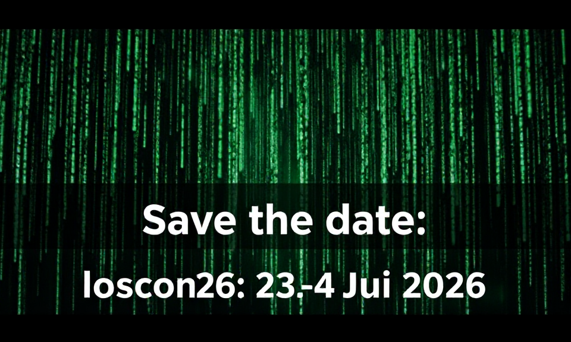

---
date:
  created: 2025-12-06
draft: false
pin: false
categories:
  - lernos
  - loscon25
  - loscon26
---

# loscon Orga Jahresausklang & Ausblick

Am **Freitag den 19.12.2025** von 10:00-11:00 Uhr treffen wir uns nochmal zu einem lockeren Jahresausklang. Wir wollen die Ereignisse seit der [loscon25](https://wiki.cogneon.de/loscon25) zusammenkehren und schonmal über die Eckpunkte der **loscon26** (23.-24. Juni 2026) sprechen. Eingeladen ist das Orga-Team, sowie alle, die nächstes Jahr in der Orga mitmachen wollen. Einwahldaten bekommt ihr ganz einfach [über diese Anmeldung](https://events.teams.microsoft.com/event/ac450ee6-ed4f-4250-964e-486fa930fbe7@93e1683c-5df4-46ff-8c5a-de6f62e19d5d) (Microsoft Teams).

<!-- more -->

Wer mitmachen will kann sich schonmal überlegen, in welchem Bereich er/sie sich einbringen möchte:

1. **Content-Team** - Kuration des Programms der loscon

2. **Deko-Team** - lässt die Lokation phyischisch und virtuell im Design strahlen

3. **AI-Integration-Team** - wir wollen dieses Jahr noch viel mehr KI vor, während und nach der loscon nutzen ("always put AI at the table")

4. **X-athon-Team** - nach dem Promptathon letztes Jahr haben wir uns für dieses Jahr etwas neues für den Slot überlegt, das braucht auch wieder Moderation und Coaches

5. **Satelliten-Team** - es soll wieder dezentrale Satelliten als Treffpunkt in anderen Städten und Organisationen geben, darum müssen wir uns mehr kümmern, als letztes Jahr

6. **Kommunikations-Team** - für die Betreung von Blog und Sozialen Medien (Mastodon, Linkedin)

7. **Community-Team** - Kontakt zu den Leitfaden Teams und Onboarding von Noobs in die Community

8. **Hybrid-Team** - kümmert sich um die "hybride Experience" der Teilnehmenden und organisiert/qualifiziert die Room Buddys

9. **Party-Team** - überlegt sich, wie wir an Abend von Tag 1 eine anständig Party (bis 10h) haben können

Bis zu dem Termin wird es dann auch das **Github-Repo** und den **Discord-Server** zur loscon26 geben, damit wir zeitgemäß dokumentieren und kommunizieren können.