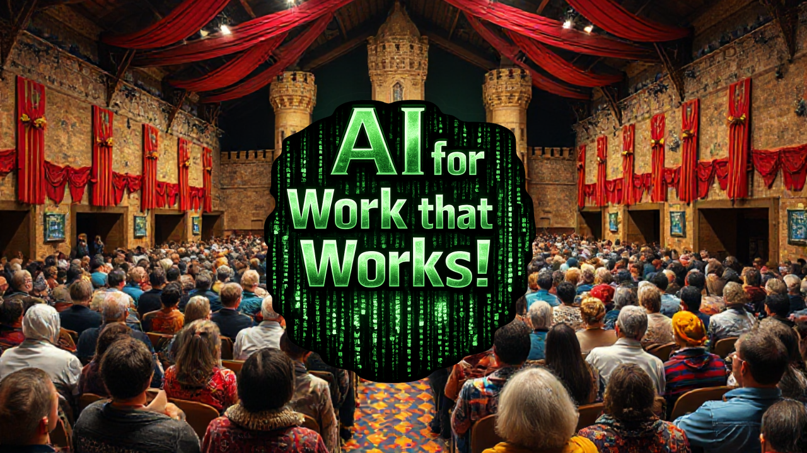

---
date:
  created: 2026-01-24
draft: false
pin: false
categories:
  - lernos
  - loscon26
---

# loscon26 Orga-Team Call for Participation

Vom **23.-24. Juni 2026** findet wieder die **lernOS Convention** unter dem Motto **"AI for Work that Works!"** auf der Kaiserburg in Nürnberg, in dezentralen Satelliten und online statt. Da so ein hybrides Multi-Format-Event gut vorbereitet sein will, formiert sich ab Freitag 30.01.2026 mal wieder das grandiose Orga-Team. Sei dabei!

<!-- more -->

Die **wöchentlichen Orga-Calls** sind jeweils **Freitags von 10:05-10:55 Uhr**. Die Orga-Calls finden in Microsoft Teams statt, mit [dieser ICS-Datei](https://cloud.cogneon.de/s/rQ75HixTab8doay) könnt ihr Euch alle Termine mit den Einwahldaten **in den Kalender importieren**.

Für den **asynchronen Austausch** verwenden wir wieder einen Kanal im Discord-Server der loscon. Der **Einladungslink** dazu wird **im Orga-Call** verteilt.