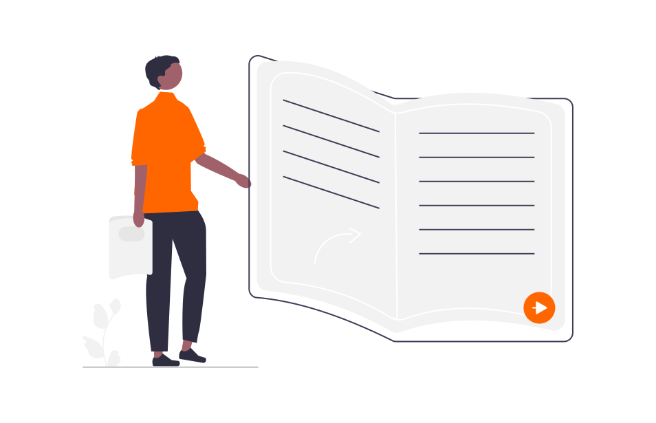

# lernOS Guidelines
The **lernOS guides** are usually around 50 pages long and are available in various formats (e.g. web, PDF, Word, eBook). They consist of a **basic chapter** with background information and a **learning path chapter** with exercises (katas). A lernOS learning path can be completed with **1-2 hours of time per week** over **a quarter** alone, in a learning tandem or in a learning group (also Circle, usually 4-5 people).

## lernOS Core
The **lernOS Core** (core) guidelines lay the foundations for continuous learning at all levels of the organisation.

1. [lernOS for You](../lernos-for-you/)
1. lernOS for Teams (not yet available)
1. [lernOS for Organizations](../lernos-for-organizations/)

## lernOS Toolbox
The **lernOS Toolbox** provides guidelines for learning proven methods, tools and formats for good knowledge management.

1. [lernOS Achtsamkeit](https://cogneon.github.io/lernos-achtsamkeit/de/)
1. [lernOS BarCamp](https://cogneon.github.io/lernos-barcamp/de/)
1. [lernOS Community Management](https://cogneon.github.io/lernos-cmgmt/de/)
1. [lernOS Content Curation](https://cogneon.github.io/lernos-content-curation/de/)
1. [lernOS Digitale Zusammenarbeit](https://cogneon.github.io/lernos-digitale-zusammenarbeit/de/)
1. [lernOS Digitales Ökosystem](https://cogneon.github.io/lernos-digitales-oekosystem/de/)
1. [lernOS Diversity & Inclusion](https://cogneon.github.io/lernos-diversity/de/)
1. [lernOS ePortfolio](https://cogneon.github.io/lernos-eportfolio/de/)
1. [lernOS Expert Debriefing](https://cogneon.github.io/lernos-expert-debriefing/de/)
1. [lernOS Künstliche Intelligenz](https://cogneon.github.io/lernos-ai/de/)
1. [lernOS Podcasting](https://cogneon.github.io/lernos-podcasting/de/)
1. [lernOS Problemlösen](https://cogneon.github.io/lernos-problem-solving/de/)
1. [lernOS Prozessmodellierung](https://cogneon.github.io/lernos-prozessmodellierung/de/)
1. [lernOS Sketchnoting](https://cogneon.github.io/lernos-sketchnoting/de/)
1. [lernOS Zettelkasten](https://cogneon.github.io/lernos-zettelkasten/de/)

## Guidelines in Development
Some guides are currently under development (0.x version) and have not yet been tested (see also [lernOS guide status](https://community.cogneon.de/t/lernos-leitfaden-status/3908)):

1. lernOS Change Management
1. [lernOS Leadership](https://cogneon.github.io/lernos-leadership/de/)

## Create your own guideline
If you would like to create your own lernOS guide, please contact [Simon Dückert](https://www.linkedin.com/in/simondueckert/). For some topics, there are already more specific ideas that can be taken up (e.g. innovation management, digital training, storytelling). 
