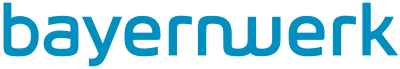
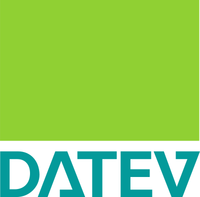
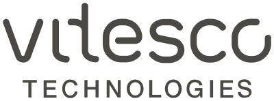

---
hide:
  - toc
---

# Welcome to lernOS

-  **lernOS** is a method for [lifelong learning](https://de.wikipedia.org/wiki/Lebenslanges_Lernen). lernOS can be used by **individuals**, **teams** and **organisations**. For exchange and interaction we use the [CONNECT Community](https://community.cogneon.de/) and a [Discord Chat Server](https://discord.gg/gY6YvZyc3A).
- <iframe width="400" height="255" src="https://www.youtube-nocookie.com/embed/JoTjZOK8L2g?si=cFXyjwTzzG9oBuqe" title="YouTube video player" frameborder="0" allow="accelerometer; autoplay; clipboard-write; encrypted-media; gyroscope; picture-in-picture; web-share" referrerpolicy="strict-origin-when-cross-origin" allowfullscreen></iframe>

## lernOS Guidelines
The lernOS guides contain learning paths to cultivate lifelong learning and a learning organisation (lernOS Core guides) or to acquire knowledge and skills for dealing with learning and knowledge (lernOS Toolbox guides). The contents of lernOS are available free of charge under the **Licence** [Creative Commons Attribution 4.0 International](https://creativecommons.org/licenses/by/4.0/deed.de) (CC BY) and can be edited and shared on the internet and intranet.

??? warning "Quick Access lernOS Guidelines"
    1. [lernOS für Dich](https://cogneon.github.io/lernos-for-you/de/)
    1. [lernOS für Organisationen](https://cogneon.github.io/lernos-for-organizations/de/)
    1. [lernOS Achtsamkeit](https://cogneon.github.io/lernos-achtsamkeit/de/)
    1. [lernOS BarCamp](https://cogneon.github.io/lernos-barcamp/de/)
    1. [lernOS Community Management](https://cogneon.github.io/lernos-cmgmt/de/)
    1. [lernOS Content Curation](https://cogneon.github.io/lernos-content-curation/de/)
    1. [lernOS Digitale Zusammenarbeit](https://cogneon.github.io/lernos-digitale-zusammenarbeit/de/)
    1. [lernOS Digitales Ökosystem](https://cogneon.github.io/lernos-digitales-oekosystem/de/)
    1. [lernOS Diversity & Inclusion](https://cogneon.github.io/lernos-diversity/de/)
    1. [lernOS ePortfolio](https://cogneon.github.io/lernos-eportfolio/de/)
    1. [lernOS Expert Debriefing](https://cogneon.github.io/lernos-expert-debriefing/de/)
    1. [lernOS Künstliche Intelligenz](https://ai.lernos.org)
    1. [lernOS Podcasting](https://cogneon.github.io/lernos-podcasting/de/)
    1. [lernOS Problem Solving](https://cogneon.github.io/lernos-problem-solving/de/)
    1. [lernOS Prozessmodellierung](https://cogneon.github.io/lernos-prozessmodellierung/de/)
    1. [lernOS Sketchnoting](https://cogneon.github.io/lernos-sketchnoting/de/)
    1. [lernOS Zettelkasten](https://cogneon.github.io/lernos-zettelkasten/de/)

## lernOS News
We distribute news about lernOS in the monthly community call (information about [this meetup group](https://www.meetup.com/cogneon/)), the [lernOS blog](https://lernos.org/de/blog/) (RSS feed), the [LinkedIn page](https://www.linkedin.com/showcase/28494203/admin/feed/posts/) and in the Fediverse at [@lernos@colearn.social](https://colearn.social/@lernos). For audio fans, there is the [lernOS on Air Podcast](https://podcasts.cogneon.io/@loa) (also as audio on demand [on Spotify](https://open.spotify.com/show/4K9CueTvOFcrAQGIyKtwRp)).

<iframe allowfullscreen sandbox="allow-top-navigation allow-scripts allow-popups allow-popups-to-escape-sandbox" width="800" height="600" src="https://mastofeed.com/apiv2/feed?userurl=https%3A%2F%2Fcolearn.social%2Fusers%2Flernos&theme=light&size=80&header=false&replies=false&boosts=false"></iframe>

## The lernOS licence

lernOS is available as a [free cultural work](https://creativecommons.org/share-your-work/public-domain/freeworks/) under the licence [Creative Commons Attribution 4.0 International](https://creativecommons.org/licenses/by/4.0/deed.de) (CC BY) ([explanatory video on the licence](https://www.youtube.com/watch?v=qDnXgMEH1vU)). According to the [Open Definition](https://opendefinition.org/od/2.1/de/) licence, you can freely access, modify and share the content.

## lernOS  Supporter
lernOS Supporters are organisations that use and promote lernOS. Each supporter organisation receives a seat on the lernOS advisory board.

&nbsp;

&nbsp;

&nbsp;

&nbsp;

&nbsp;

&nbsp;

&nbsp;

&nbsp;

