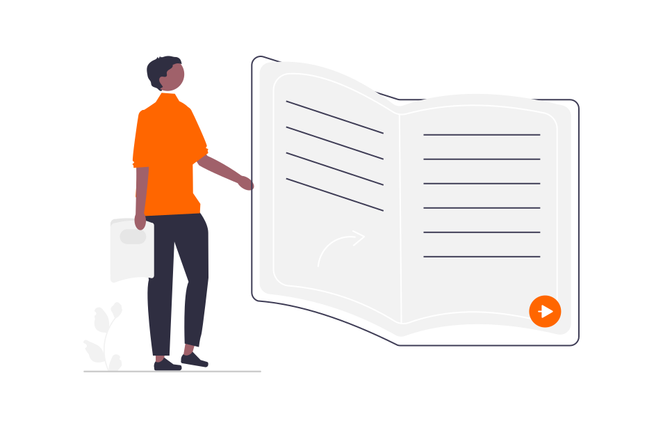

# Panduan lernOS
**Panduan lernOS** biasanya memiliki panjang sekitar 50 halaman dan tersedia dalam berbagai format (misalnya web, PDF, Word, eBook). Panduan ini terdiri dari **bab dasar** dengan informasi latar belakang dan **bab jalur pembelajaran** dengan latihan (kata). Sebuah jalur pembelajaran lernOS dapat diselesaikan dengan **waktu 1-2 jam per minggu** selama **satu kuartal**, baik sendiri, dalam tandem belajar, atau dalam kelompok belajar (disebut Circle, biasanya 4-5 orang).

## Inti lernOS (lernOS Core)
Panduan **Inti lernOS** meletakkan dasar untuk pembelajaran berkelanjutan di semua tingkatan organisasi.

1. [lernOS untuk Anda (lernOS for You)](../lernos-for-you/)
1. lernOS untuk Tim (belum tersedia)
1. [lernOS untuk Organisasi (lernOS for Organizations)](../lernos-for-organizations/)

## Kotak Perkakas lernOS (lernOS Toolbox)
**Kotak Perkakas lernOS** menyediakan panduan untuk mempelajari metode, alat, dan format yang terbukti ampuh untuk manajemen pengetahuan yang baik.

1. [lernOS Kesadaran Diri (Mindfulness)](https://cogneon.github.io/lernos-achtsamkeit/de/)
1. [lernOS BarCamp](https://cogneon.github.io/lernos-barcamp/de/)
1. [lernOS Manajemen Komunitas](https://cogneon.github.io/lernos-cmgmt/de/)
1. [lernOS Kurasi Konten](https://cogneon.github.io/lernos-content-curation/de/)
1. [lernOS Kolaborasi Digital](https://cogneon.github.io/lernos-digitale-zusammenarbeit/de/)
1. [lernOS Ekosistem Digital](https://cogneon.github.io/lernos-digitales-oekosystem/de/)
1. [lernOS Keberagaman & Inklusi](https://cogneon.github.io/lernos-diversity/de/)
1. [lernOS ePortfolio](https://cogneon.github.io/lernos-eportfolio/de/)
1. [lernOS Debriefing Ahli](https://cogneon.github.io/lernos-expert-debriefing/de/)
1. [lernOS Kecerdasan Buatan (AI)](https://cogneon.github.io/lernos-ai/de/)
1. [lernOS Podcasting](https://cogneon.github.io/lernos-podcasting/de/)
1. [lernOS Pemecahan Masalah](https://cogneon.github.io/lernos-problem-solving/de/)
1. [lernOS Pemodelan Proses](https://cogneon.github.io/lernos-prozessmodellierung/de/)
1. [lernOS Sketchnoting](https://cogneon.github.io/lernos-sketchnoting/de/)
1. [lernOS Zettelkasten](https://cogneon.github.io/lernos-zettelkasten/de/)

## Panduan dalam Pengembangan
Beberapa panduan saat ini sedang dalam pengembangan (versi 0.x) dan belum diuji (lihat juga [status panduan lernOS](https://community.cogneon.de/t/lernos-leitfaden-status/3908)):

1. lernOS Manajemen Perubahan (Change Management)
1. [lernOS Kepemimpinan (Leadership)](https://cogneon.github.io/lernos-leadership/de/)

## Buat panduan Anda sendiri
Jika Anda ingin membuat panduan lernOS Anda sendiri, silakan hubungi [Simon Dückert](https://www.linkedin.com/in/simondueckert/). Untuk beberapa topik, sudah ada ide yang lebih spesifik yang dapat diambil (misalnya manajemen inovasi, pelatihan digital, storytelling).