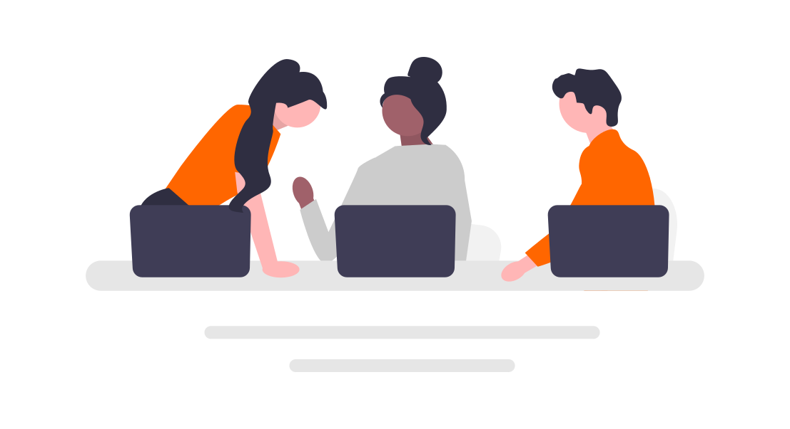

# Belajar dalam Lingkaran
Jalur pembelajaran dalam [Panduan lernOS](/id/1-guides/) dapat diselesaikan sendiri, berpasangan dalam tandem belajar, atau dengan 4-5 orang dalam **kelompok belajar** (lingkaran belajar/learning circle). Kami sangat menyarankan kelompok belajar bagi pendatang baru lernOS (noobs), idealnya dengan setidaknya satu orang yang sudah berpengalaman.

Kelompok belajar menjalani jalur pembelajaran, biasanya selama satu kuartal, yang di lernOS juga kami sebut sebagai sprint belajar (learning sprint), berdasarkan Scrum. Sprint dimulai pada minggu ke-0 dengan perencanaan. Minggu ke-1 hingga ke-11 diisi dengan latihan (kata) dari jalur pembelajaran yang digunakan. Sprint berakhir pada minggu ke-12 dengan retrospektif dan perayaan bersama atas apa yang telah dicapai.

**Keuntungan belajar dalam kelompok:**

* Anda tidak sendirian
* Semua orang bisa saling membantu - dalam 'Lingkaran Kepercayaan' (Circle of Trust)
* Setiap orang dapat mengejar tujuan belajarnya masing-masing
* Risiko berhenti di tengah jalan lebih rendah (seperti dalam kelompok olahraga/lari)
* Pertemuan dimungkinkan secara tatap muka, virtual, maupun hibrida

## Minggu 0: Kelompok belajar dimulai
Seperti halnya perjalanan nyata, perencanaan di awal sangat penting untuk memastikan perjalanan tersebut sukses. Berikut adalah daftar periksa kecil untuk membantu Anda memulai bersama di minggu ke-0:

**Saran agenda minggu 0:**

* **Check-in:** Selamat datang! *(5 menit)*
* **Perkenalan (Get together):** Siapa Anda? Perkenalkan diri Anda. Mengapa Anda di sini? Apa tujuan belajar Anda? Alokasi waktu lima menit per orang. *(25 menit)*
* **Perencanaan Sprint** lihat di bawah *(25 menit)*
* **Check-out:** Konfirmasi pertemuan berikutnya. *(5 menit)*

**Tentukan di minggu 0:**

1. Tunjuk seorang koordinator untuk kelompok belajar. Peran ini bisa tetap atau bergantian selama perjalanan belajar.
1. Tentukan jalur pembelajaran yang ingin Anda jalani bersama.
1. Tetapkan hari dan waktu untuk pertemuan mingguan (lernOS Weekly). Jadwalkan semua 13 pertemuan di kalender.
1. Putuskan apakah Anda ingin membahas konten latihan mingguan di dalam Weekly, atau apakah setiap orang akan mempelajarinya sebelumnya dan hanya bertukar pengalaman serta memberikan bantuan saat Weekly.
1. Putuskan apakah Anda ingin bertemu secara tatap muka, virtual, atau hibrida.
1. Tentukan alat apa yang ingin Anda gunakan untuk komunikasi dan dokumentasi (misalnya [Templat Lingkaran lernOS](https://github.com/cogneon/lernos-core/tree/master/lernOS%20Circle%20Template)) dalam kelompok belajar. Pastikan semua orang bisa menggunakan alat tersebut dan menyukainya.

## Minggu 1-12: Daftar periksa untuk koordinator lingkaran
Saat belajar dalam kelompok, daftar periksa ini membantu koordinator untuk mengatur pertemuan mingguan secara terstruktur. Sebaiknya salin daftar periksa ini ke tempat di mana semua anggota kelompok belajar memiliki akses (misalnya OneNote, Etherpad, OneDrive, Dropbox).

**MINGGU 1**

* **Check-in:** Apa yang telah saya lakukan sejak check-in terakhir? Apa yang berubah pada hasil utama (key results)? Apa yang menghalangi saya? Alokasi waktu dua menit per anggota Lingkaran. *(10 menit)*
* Diskusikan hasil latihan (kata) dari jalur pembelajaran terkait
* **Check-out:** Apa yang akan saya lakukan sampai Weekly berikutnya? Alokasi waktu satu menit per anggota Lingkaran. *(5 menit)*

**MINGGU 2**

* **Check-in:** Apa yang telah saya lakukan sejak check-in terakhir? Apa yang terjadi dengan hasil utama? Apa yang menghalangi saya? Alokasi waktu dua menit per anggota Lingkaran. *(10 menit)*
* Diskusikan hasil latihan (kata) dari jalur pembelajaran terkait
* **Check-out:** Apa yang akan saya lakukan sampai Weekly berikutnya? Alokasi waktu satu menit per anggota Lingkaran. *(5 menit)*

**MINGGU 3**

* **Check-in:** Apa yang telah saya lakukan sejak check-in terakhir? Apa yang terjadi dengan hasil utama? Apa yang menghalangi saya? Alokasi waktu dua menit per anggota Lingkaran. *(10 menit)*
* Diskusikan hasil latihan (kata) dari jalur pembelajaran terkait
* **Check-out:** Apa yang akan saya lakukan sampai Weekly berikutnya? Alokasi waktu satu menit per anggota Lingkaran. *(5 menit)*

**MINGGU 4 & Pit Stop 1**

* **Check-in:** Apa yang telah saya lakukan sejak check-in terakhir? Apa yang terjadi dengan hasil utama? Apa yang menghalangi saya? Alokasi waktu dua menit per anggota Lingkaran. *(10 menit)*
* Diskusikan hasil latihan (kata) dari jalur pembelajaran terkait
* **Check-out:** Apa yang akan saya lakukan sampai Weekly berikutnya? Alokasi waktu satu menit per anggota Lingkaran. *(5 menit)*

**MINGGU 5**

* **Check-in:** Apa yang telah saya lakukan sejak check-in terakhir? Apa yang terjadi dengan hasil utama? Apa yang menghalangi saya? Alokasi waktu dua menit per anggota Lingkaran. *(10 menit)*
* Diskusikan hasil latihan (kata) dari jalur pembelajaran terkait
* **Check-out:** Apa yang akan saya lakukan sampai Weekly berikutnya? Alokasi waktu satu menit per anggota Lingkaran. *(5 menit)*

**MINGGU 6**

* **Check-in:** Apa yang telah saya lakukan sejak check-in terakhir? Apa yang terjadi dengan hasil utama? Apa yang menghalangi saya? Alokasi waktu dua menit per anggota Lingkaran. *(10 menit)*
* Diskusikan hasil latihan (kata) dari jalur pembelajaran terkait
* **Check-out:** Apa yang akan saya lakukan sampai Weekly berikutnya? Alokasi waktu satu menit per anggota Lingkaran. *(5 menit)*

**MINGGU 7**

* **Check-in:** Apa yang telah saya lakukan sejak check-in terakhir? Apa yang terjadi dengan hasil utama? Apa yang menghalangi saya? Alokasi waktu dua menit per anggota Lingkaran. *(10 menit)*
* Diskusikan hasil latihan (kata) dari jalur pembelajaran terkait
* **Check-out:** Apa yang akan saya lakukan sampai Weekly berikutnya? Alokasi waktu satu menit per anggota Lingkaran. *(5 menit)*

**MINGGU 8 & Pit Stop 2**

* **Check-in:** Apa yang telah saya lakukan sejak check-in terakhir? Apa yang terjadi dengan hasil utama? Apa yang menghalangi saya? Alokasi waktu dua menit per anggota Lingkaran. *(10 menit)*
* Diskusikan hasil latihan (kata) dari jalur pembelajaran terkait
* **Check-out:** Apa yang akan saya lakukan sampai Weekly berikutnya? Alokasi waktu satu menit per anggota Lingkaran. *(5 menit)*

**MINGGU 9**

* **Check-in:** Apa yang telah saya lakukan sejak check-in terakhir? Apa yang terjadi dengan hasil utama? Apa yang menghalangi saya? Alokasi waktu dua menit per anggota Lingkaran. *(10 menit)*
* Diskusikan hasil latihan (kata) dari jalur pembelajaran terkait
* **Check-out:** Apa yang akan saya lakukan sampai Weekly berikutnya? Alokasi waktu satu menit per anggota Lingkaran. *(5 menit)*

**MINGGU 10**

* **Check-in:** Apa yang telah saya lakukan sejak check-in terakhir? Apa yang terjadi dengan hasil utama? Apa yang menghalangi saya? Alokasi waktu dua menit per anggota Lingkaran. *(10 menit)*
* Diskusikan hasil latihan (kata) dari jalur pembelajaran terkait
* **Check-out:** Apa yang akan saya lakukan sampai Weekly berikutnya? Alokasi waktu satu menit per anggota Lingkaran. *(5 menit)*

**MINGGU 11**

* **Check-in:** Apa yang telah saya lakukan sejak check-in terakhir? Apa yang terjadi dengan hasil utama? Apa yang menghalangi saya? Alokasi waktu dua menit per anggota Lingkaran. *(10 menit)*
* Diskusikan hasil latihan (kata) dari jalur pembelajaran terkait
* **Check-out:** Apa yang akan saya lakukan sampai Weekly berikutnya? Alokasi waktu satu menit per anggota Lingkaran. *(5 menit)*

**MINGGU 12: Retrospektif & Perayaan**

Minggu ini Anda seharusnya sudah memiliki iterasi terakhir dari Hasil Utama (Key Results) Anda. Bicarakan dan tunjukkan saat check-in. Anda akan merefleksikan pengalaman di dalam Lingkaran dan membicarakan bagaimana Anda dapat menjaga proses ini tetap berjalan. Setelah Weekly, luangkan waktu untuk merayakan kesuksesan Anda!

* **Check-in:** Apa yang telah saya lakukan sejak check-in terakhir? Tunjukkan iterasi terakhir dari Hasil Utama. Alokasi waktu tiga menit per anggota Lingkaran. *(15 menit)*
* **Momen Belajar Anda:** Ceritakan tentang momen-momen dalam sprint yang spesial bagi Anda. Apa pembelajaran utama Anda? Pikirkan apakah Anda ingin mempublikasikannya sebagai [Kisah lernOS](https://docs.google.com/forms/d/e/1FAIpQLSc9KrufUD9Mu9wstGv8ojfChRwPlq2dVi_kAUB04MuymmzUSg/viewform) untuk semua praktisi lainnya. _(20 menit)_
* **Tinjauan Pasca Tindakan (After Action Review):** Apa rencana untuk sprint ini? Apa yang terjadi? Apakah ada penyimpangan? Apa yang bisa Anda pelajari darinya? _(20 menit)_
* **Check-out:** Apakah ada langkah selanjutnya? Apakah Anda akan tetap bersama untuk sprint berikutnya?
* **Waktunya Pesta!** * *(Anda yang menentukan durasinya)*