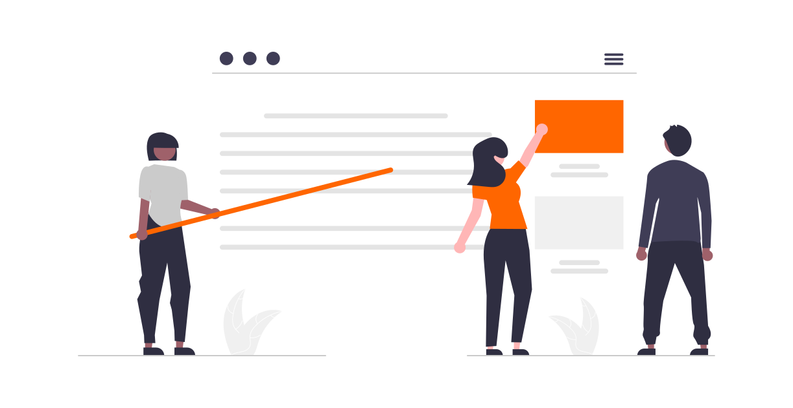

---
hide:
  - toc
---

# Publikasi
Di halaman ini kami mengumpulkan **publikasi tentang lernOS**. Ini termasuk artikel, blog, kuliah, podcast, dan video. Jika Anda mengetahui sumber yang relevan, beri tahu kami atau masukkan tautannya dalam komentar di bawah.

***Catatan:** sebagian besar publikasi dan deskripsi tersedia dalam bahasa Jerman.*

## 2024
* Presentasi [Zurück in die Zukunft der Arbeit](https://www.youtube.com/watch?v=gixIEuf64sg) (Kembali ke Masa Depan Pekerjaan) ([Slide](https://simondueckert.github.io/presentations/rasc24/)) oleh Simon Dückert di Radikal Arbeiten Sommercamp (juga tersedia [sebagai Podcast](https://podcasts.cogneon.io/@kclo/episodes/zuruck-in-die-zukunft-der-arbeit-mit-simon-duckert))
* Buku [Learning Circles: Die Kraft der Learning Circles: Umsetzung, Wirkung und Einsatzmöglichkeiten](https://amzn.to/3AtsZqS) dengan beberapa bab tentang lernOS (Editor: Nele Graf dan Ursula Liebhart)

## 2023
* [Lightning Talk tentang rantai produksi lernOS](/blog/2024/01/19/lightning-talk-zur-lernos-produktionskette-auf-dem-37c3/) pada Chaos Communication Congress ke-37
* Podcast [KCLO108 x Freakshow @ EnBW – Tinjauan Konvensi lernOS 2023](https://cogneon.de/podcast/2023/07/31/kclo108-x-freakshow-enbw-ein-rueckblick-auf-die-lernos-convention-2023/) (versi publik dari podcast internal EnBW)
* Konvensi lernOS 2023 "Crafting Learning Environments" 11-12 Juli 2023 di Kaiserburg Nürnberg dan online ([Dokumentasi](https://wiki.cogneon.de/LernOS_Convention_2023), [Video](https://www.youtube.com/watch?v=W0UaN3bcmXc&pp=ygUbbG9zY29uMjMgaW1wcmVzc2lvbiBjb2duZW9u))
* Sesi lernOS 101 & AMA pada Expedition Arbeit Barcamp 29 April 2023 di Fürth (memperbarui [Presentasi Dasar lernOS](https://cogneon.github.io/lernos/de-slides))

## 2022

* Sesi [Making-of Konvensi lernOS 2022](https://youtu.be/vPHEhRyjdDI) 9 September 2022
* Artikel tentang Konvensi lernOS di majalah [wirtschaft+weiterbildung Edisi 9/2022](https://www.haufe.de/personal/zeitschrift/wirtschaft-weiterbildung/wirtschaft-weiterbildung-ausgabe-92022-wirtschaft-weiterbildung_48_573890.html) (PDF)
* Wawancara [Lernen, lernOS, Trends im Corporate Learning und mehr](https://leipzig-hrm-blog.blogspot.com/2022/08/lernen-lernos-trends-im-corporate.html) dengan Simon Dückert di Blog HRM Leipzig
* Konvensi lernOS 2022 "The Re-Return of Knowledge Management" 5-6 Juli 2022 di Kaiserburg Nürnberg dan online ([Dokumentasi](https://wiki.cogneon.de/LernOS_Convention_2022), [Video](https://www.youtube.com/watch?v=r9talnVcpYc]))
* Sesi [#DATEVlernt](https://www.youtube.com/watch?v=yhwNhiOLc4Y) di ahrc2022 27 April 2022 di Köln
* Blog [Kirche kann/soll/muss lernen!? lernOS und #WOL kann helfen](https://gottdigital.de/kirche-kann-soll-muss-lernen-lernos-und-wol-kann-helfen) dari 23 April 2022
* Video [lernOS - Sebuah Pengantar](https://www.youtube.com/watch?v=JoTjZOK8L2g)
* Blog [Ich brauchte eine Struktur – laporan seorang mahasiswi dari lingkaran lernOS-nya](https://www.fernuni-hagen.de/zli/blog/ich-brauchte-eine-struktur-eine-studentin-berichtet-aus-ihrem-lernos-zirkel/) dari 1 Februari 2022
* Presentasi [Panduan Manajemen Komunitas lernOS](https://www.youtube.com/watch?v=2CyrFjiXqaM) di Meetup C3Managers 20 Januari 2022
* Podcast Freihändig Episode 57 [lernOS für Organisationen und Selbstlernprozesse](https://www.oliver-koenig.net/2022/01/13/simon-dueckert-lernos-fuer-organisationen-und-selbstlernprozesse-057/) dari 13 Januari 2022

## 2021

* [Barcamp DiversityStoryThatMatter]([https://hopin.com/events/diversitystoriesthatmatter) 10 Desember (online)
* Sesi [ISO 30401 mit dem lernOS für Organisationen Canvas](https://www.youtube.com/watch?v=gv5lynQlWEU) 19 November 2021 di KnowledgeCamp (#gkc21)
* Sesi [Making-of Konvensi lernOS 2021](https://www.youtube.com/watch?v=fk4rz86pahM) 23 Juli 2021
* Konvensi lernOS 2021 "Agil trifft Lernende Organisation" 24-25 Juni 2021 online ([Dokumentasi](https://wiki.cogneon.de/LernOS_Convention_2021), [Video](https://www.youtube.com/watch?v=5v_Gcvdy3no))

## 2020

- Podcast [Lebenslanges Lernen mit lernOS](https://fyyd.de/episode/5173375) di Podcast Klartext HR
- Sesi [WOL - Back to the Roots](https://www.youtube.com/watch?v=9sCpcEi7uAM) di WOL Camp 26 November 2020
- Podcast [Lebenslanges Lernen und lernOS](https://wohnzimmer.fm/firmenfunk/ff092-lebenslanges-lernen-und-lernos/) di Podcast Firmenfunk Episode 92 dari 12 November 2020
- [lernOS All Stars Camp](https://wiki.cogneon.de/loscamp20) 23-24 Juni 2020 (online)
- Presentasi [lernOS in a Nutshell](https://www.youtube.com/watch?v=F5-f61GvXE4) 15 Juni 2020 di GfWM Regionalgruppe Frankfurt-Rhein-Main
- Video tentang lernOS for You [di LinkedIn](https://www.linkedin.com/posts/theresa-laudenbach-4559a5200_lernos-lebenslangeslernen-fau-ugcPost-6770754811093684224-uIA8)
- Podcast Gelbe Raben [Über Wissensmanagement und lernende Organisationen](https://anchor.fm/barbara-brning6/episodes/ber-Wissensmanagement-und-lernende-Organisationen---im-Gesprch-mit-Simon-Dckert-e1elmo0/a-a7esj08) dari 20 Februari 2022

## 2019

* Presentasi [lernOS - Hacking How We Learn - Lifelong](https://www.youtube.com/watch?v=7atMXYyzkBc) 30 Desember 2019 pada 36c3 di Leipzig
* Blog [Die 13 wichtigsten Unterschiede zwischen lernOS und WOL](https://cogneon.de/2019/07/13/di3-13-wichtigsten-unterschiede-zwischen-lernos-und-wol/) (13 perbedaan terpenting antara lernOS dan WOL)
* Artikel [Das Projekt lernOS - Fahrplan fürs Lebenslange Lernen](https://www.managerseminare.de/ms_Artikel/Das-Projekt-lernOS-Fahrplan-fuers-Lebenslange-Lernen,272084) di managerSeminare Edisi 256
* [lernOS Rockstars Camp](https://community.cogneon.de/t/1-lernos-rockstars-camp/) 25 Juni 2019 di München
* Bab Buku *lernOS als Betriebssystem für die Arbeit der Zukunft* oleh Simon Dückert dalam [Faszination New Work: 50 Impulse für die neue Arbeitswelt](https://amzn.to/3issdMx)

## 2018

- Presentasi [lernOS – Lebenslanges Lernen und Aufbau digitaler Kompetenzen für alle Bürger](https://www.youtube.com/watch?v=Wfe7HsqvqrQ) 18 Oktober 2018 di Erding
- [Rilis lernOS untuk Anda Versi 1.0](https://www.youtube.com/watch?v=qD8cLcl8g3s) 18 September 2018
- Blog [lernOS Canvas - A Tool for WOL(TM) Circle Alumni and Knowledge Workers](https://cogneon.de/2018/05/24/wol-a-tool-for-wol-circle-alumni-and-knowledge-workers/) (Perubahan nama dari WOL+ Canvas menjadi lernOS Canvas)
- Presentasi [Learning Organization - State of the Union - von lernOS, GTD, OKR, PKM, WOL & Co.](https://www.youtube.com/watch?v=H3O3eAY7XrI) 22 Juni 2018 di KnowTouch di Nürnberg

## 2017

* Sesi [lernOS - Organisationssystem für lernende Organisationen](https://cogneon.de/2017/10/02/lernos-session-auf-dem-corporate-learning-camp) di Corporate Learning Camp 29 September 2017 di Frankfurt

## 2016

* Podcast [Cogneon 2.0](https://cogneon.de/2016/12/23/m2p026-cogneon-2-0/) dengan rekaman perayaan 15 tahun Cogneon. Di sana kami berbicara tentang masa lalu dan masa depan kami serta meluncurkan proyek lernOS selama 6 tahun.

* [Knowledge Jam #ckj25 Digital Leadership](https://wiki.cogneon.de/Cogneon_Knowledge_Jam/Digital_Leadership_(ckj25)) dengan ceramah pengantar Working Out Loud oleh John Stepper dan sesi ganda *In Search of a WOL Business Model* di Akademi Cogneon di Nürnberg