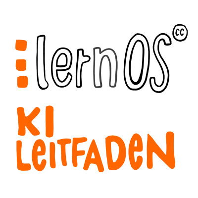

# Panduan lernOS Kecerdasan Buatan (AI)

[**Panduan lernOS AI**](https://ai.lernos.org/en/) memperkenalkan orang-orang **tanpa pelatihan AI sebelumnya** ke topik [Kecerdasan Buatan](https://id.wikipedia.org/wiki/Kecerdasan_buatan) dan khususnya [AI Generatif](https://id.wikipedia.org/wiki/AI_generatif). Mereka dapat menggunakan jalur pembelajaran untuk membuat **keputusan yang tepat** mengenai apakah dan bagaimana mereka terpengaruh serta **manfaat** apa yang bisa mereka dapatkan dari AI generatif. Panduan ini dapat digunakan dengan **alat AI di dalam maupun di luar organisasi** (di internet misalnya ChatGPT, di intranet misalnya Microsoft Copilot).

[Panduan lernOS AI](https://ai.lernos.org/en/){ .md-button .md-button--primary }

## Kelompok Sasaran
Panduan lernOS AI ditujukan bagi **orang-orang** yang duduk **"di depan layar"**, **bukan bagi pengembang AI**. Namun, pengguna harus memahami latar belakang AI Generatif. Jalur pembelajaran dapat diselesaikan **sendiri**, **dalam tandem belajar**, atau dalam **lingkaran belajar (circle)**. Dibutuhkan waktu **sekitar 1-2 jam** per latihan (kata).

## Konten
- AI Generatif, pembelajaran mesin (machine learning), dan jaringan saraf tiruan (artificial neural networks)
- Bidang aplikasi tipikal untuk AI generatif
- Model AI, alat, dan layanan
- Prompting, Prompt Engineering
- AI Generatif dan dampak sosialnya

## Tautan
- Versi web [Panduan lernOS AI](https://ai.lernos.org/en/) (versi lain seperti PDF ditautkan di sana dalam navigasi di bawah *Download*)
- Kategori [lernOS Artificial Intelligence di CONNECT](https://community.cogneon.de/c/lernos/lernos-kuenstliche-intelligenz/76) untuk pertanyaan, diskusi, dan pertukaran pengalaman

## Testimoni
> "Di sini bisa jadi kutipan Anda" (dan di sini nama Anda) 😉

## Tim panduan saat ini (berdasarkan urutan abjad)
1. [Benedikt Scheerer](https://www.linkedin.com/in/benedikt-scheerer-6020ba18/)
1. [Doris Schuppe](https://www.linkedin.com/in/doschu/)
1. [Ellen Braun](https://www.linkedin.com/in/ellen-braun-work-and-feelgood/)
1. [Hans Gaertner](https://www.linkedin.com/in/hgaertner/)
1. [Marcel Kirchner](https://www.linkedin.com/in/marcelkirchner/)
1. [Moritz Meissner](https://www.linkedin.com/in/moritz-meissner/)
1. [Oliver Ewinger](https://www.linkedin.com/in/oliver-ewinger/)
1. [Oliver Pincus](https://www.linkedin.com/in/oliverpincus/)
1. [Ruben Weiser](https://www.linkedin.com/in/dr-ruben-weiser-b109411ab/)
1. [Simon Dückert](https://www.linkedin.com/in/simondueckert/) (Maintainer)
1. [Simon Roderus](https://www.linkedin.com/in/simon-roderus/)
1. [Stefan Strobel](https://www.linkedin.com/in/stefan-strobel-haiilo/)
1. [Susann Schulz](https://www.linkedin.com/in/susannschulz/)
1. [Thomas Küll](https://www.linkedin.com/in/thomas-k%C3%BCll-46a5b1162/)
1. [Tilo Eissmann](https://www.linkedin.com/in/tilo-ei%C3%9Fmann-09a58369/)
1. [Ute Reichert](https://www.linkedin.com/in/ute-reichert-6945141a3/)
