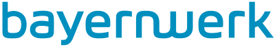
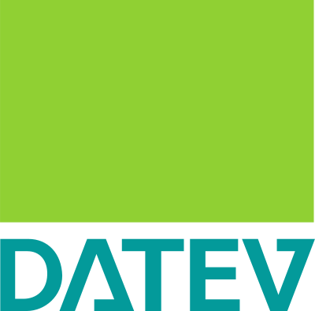
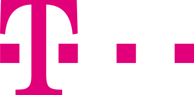
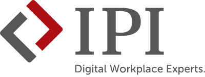
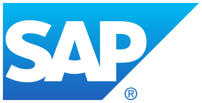
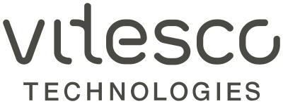

---
hide:
  - toc
---

# Selamat Datang di lernOS

**lernOS** adalah sebuah metode untuk [pembelajaran seumur hidup](https://id.wikipedia.org/wiki/Pendidikan_seumur_hidup). lernOS dapat digunakan oleh **individu**, **tim**, dan **organisasi**. Untuk bertukar pikiran dan interaksi, kami menggunakan [Komunitas CONNECT](https://community.cogneon.de/) dan [Server Chat Discord](https://discord.gg/gY6YvZyc3A).

<iframe width="400" height="255" src="https://www.youtube-nocookie.com/embed/JoTjZOK8L2g?si=cFXyjwTzzG9oBuqe" title="YouTube video player" frameborder="0" allow="accelerometer; autoplay; clipboard-write; encrypted-media; gyroscope; picture-in-picture; web-share" referrerpolicy="strict-origin-when-cross-origin" allowfullscreen></iframe>

## Panduan lernOS
[Panduan lernOS](1-guides.md) berisi jalur pembelajaran untuk menumbuhkan budaya belajar seumur hidup dan organisasi pembelajar (*lernOS Core guides*) atau untuk memperoleh pengetahuan dan keterampilan dalam menangani pembelajaran dan pengetahuan (*lernOS Toolbox guides*). Konten lernOS tersedia secara gratis di bawah **Lisensi** [Creative Commons Attribution 4.0 International](https://creativecommons.org/licenses/by/4.0/deed.id) (CC BY) serta dapat diubah dan dibagikan di internet maupun intranet.

[Panduan lernOS](1-guides.md){ .md-button .md-button--primary }

## Berita lernOS
Kami mendistribusikan berita tentang lernOS melalui panggilan komunitas bulanan (informasi tentang [grup meetup ini](https://www.meetup.com/cogneon/)), [blog lernOS](https://lernos.org/de/blog/) (RSS feed), [halaman LinkedIn](https://www.linkedin.com/showcase/28494203/admin/feed/posts/), dan di Fediverse melalui [@lernos@colearn.social](https://colearn.social/@lernos). Untuk penggemar audio, terdapat [Podcast lernOS on Air](https://podcasts.cogneon.io/@loa) (juga tersedia sebagai audio on demand [di Spotify](https://open.spotify.com/show/4K9CueTvOFcrAQGIyKtwRp)).

<iframe allowfullscreen sandbox="allow-top-navigation allow-scripts allow-popups allow-popups-to-escape-sandbox" width="800" height="600" src="https://mastofeed.com/apiv2/feed?userurl=https%3A%2F%2Fcolearn.social%2Fusers%2Flernos&theme=light&size=80&header=false&replies=false&boosts=false"></iframe>

## Lisensi lernOS

lernOS tersedia sebagai [karya budaya bebas](https://creativecommons.org/share-your-work/public-domain/freeworks/) di bawah lisensi [Creative Commons Attribution 4.0 International](https://creativecommons.org/licenses/by/4.0/deed.id) (CC BY) ([video penjelasan tentang lisensi](https://www.youtube.com/watch?v=qDnXgMEH1vU)). Sesuai dengan [Definisi Terbuka](https://opendefinition.org/od/2.1/de/), Anda bebas untuk mengakses, memodifikasi, dan membagikan konten ini.

## Pendukung lernOS
Pendukung lernOS adalah organisasi yang menggunakan dan mempromosikan lernOS. Setiap organisasi pendukung mendapatkan kursi di dewan penasihat lernOS.

&nbsp;

&nbsp;

&nbsp;

&nbsp;

&nbsp;

&nbsp;

&nbsp;

&nbsp;

