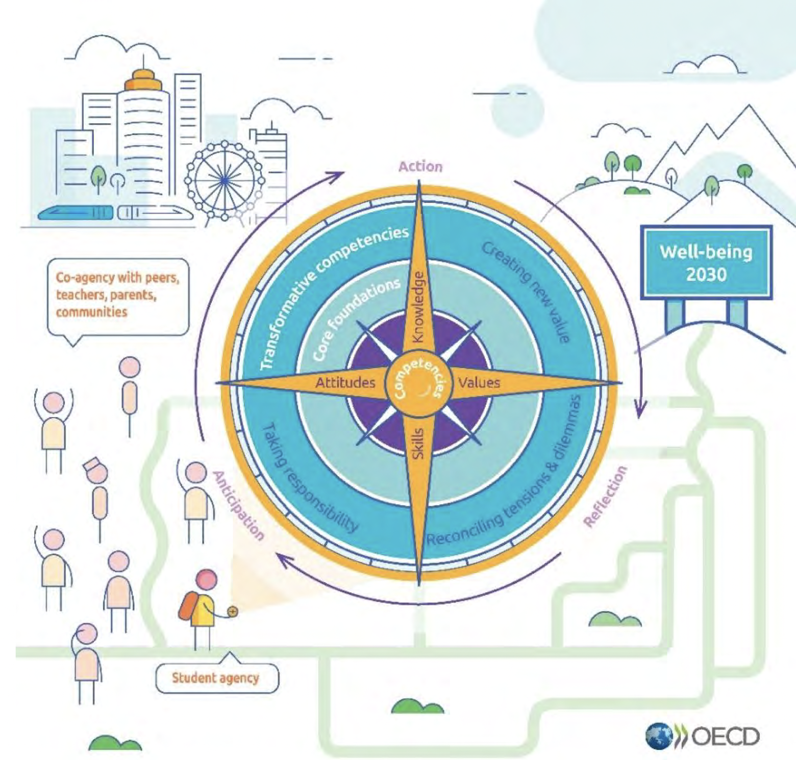

*Language: en, [de](/lernos/)*

**Constant change** and our **future well-being** require **continuous, self-organized learning**. Lifelong learning as well as learning in teams and organisations ensures a good future for all of us (see also [OECD Learning Compass 2030](https://www.oecd.org/education/2030-project/contact/OECD_Learning_Compass_2030_Concept_Note_Series.pdf)):

**lernOS** is an [open system](https://en.wikipedia.org/wiki/Open_system_(systems_theory)) for [lifelong learning](https://en.wikipedia.org/wiki/Lifelong_learning) and [learning organisations](https://en.wikipedia.org/wiki/Learning_organization). The functioning of lernOS is described in [openly](https://opendefinition.org/od/2.1/de/) available **guides**. lernOS can be easily practised as **individual**, in a **team** or in the whole **organisation**.

With lernOS it is like with [the blind men and the elephant](https://en.wikipedia.org/wiki/Blind_men_and_an_elephant): seen from different angles, lernOS means different things. The most important angles are:

* Open system for lifelong learning and learning organizations
* Brainware ... not software!
* Verb in Esperanto, I/we will learn (mi/ni lernos)
* Project of the [Cogneon Academy](https://lernos.org) that runs from 2016-2022
* Collection of openly available guidelines

The **lernOS Quick-Start-Guide** (only German) provides a quick introduction into the topic and the most important concepts of lernOS (Download as [PDF](./downloads/lernOS-Quick-Start-Guide-en-v03.pdf), [PPT](./downloads/lernOS-Quick-Start-Guide-en-v03.pptx)). With the **[lernOS Web-Presentation](https://cogneon.github.io/lernos/presentation/en/)** (only German) you can easily present lernOS at events, barcamps, meetups, conferences, departmental rounds, regular meetings etc.

# lernOS Guides
The **lernOS Core** provides guides at the individual, team and organizational levels. The **lernOS Toolbox** provides further guides to proven tools and methods that promote good knowledge management practices. The lernOS content can be downloaded in various formats and languages. Currently available:

|                              | Description                                                  | Web                                                          | PDF                                                          | DOCX                                                         | MOBI                                                         | EPUB                                                         | HTML                                                         |
| ---------------------------- | ------------------------------------------------------------ | ------------------------------------------------------------ | ------------------------------------------------------------ | ------------------------------------------------------------ | ------------------------------------------------------------ | ------------------------------------------------------------ | ------------------------------------------------------------ |
| **lernOS Core**              |                                                              |                                                              |                                                              |                                                              |                                                              |                                                              |                                                              |
| lernOS for You               | Die Kunst des selbstgesteuerten, lebenslangenen Lernens      | [de](https://cogneon.github.io/lernos-for-you/de/)           | [de](https://raw.githubusercontent.com/cogneon/lernos-for-you/master/de/lernOS-fuer-Dich-Leitfaden.pdf) | [de](https://raw.githubusercontent.com/cogneon/lernos-for-you/master/de/lernOS-fuer-Dich-Leitfaden.docx) | [de](https://raw.githubusercontent.com/cogneon/lernos-for-you/master/de/lernOS-fuer-Dich-Leitfaden.mobi) | [de](https://raw.githubusercontent.com/cogneon/lernos-for-you/master/de/lernOS-fuer-Dich-Leitfaden.epub) | [de](https://github.com/cogneon/lernos-for-you/raw/master/de/lernOS-fuer-Dich-Leitfaden.html) |
| lernOS for Teams             | (noch nicht verfügbar)                                       |                                                              |                                                              |                                                              |                                                              |                                                              |                                                              |
| lernOS for Organisatizations | Gemeinsam Lernende Organisationen entwickeln                 | [de](https://cogneon.github.io/lernos-for-organizations/de/) | [de](https://raw.githubusercontent.com/cogneon/lernos-for-organizations/master/de/lernOS-Guide-for-Organizations-de.pdf) | [de](https://github.com/cogneon/lernos-for-organizations/raw/master/de/lernOS-Guide-for-Organizations-de.docx) | [de](https://github.com/cogneon/lernos-for-organizations/raw/master/de/lernOS-Guide-for-Organizations-de.mobi) | [de](https://github.com/cogneon/lernos-for-organizations/raw/master/de/lernOS-Guide-for-Organizations-de.epub) | [de](https://github.com/cogneon/lernos-for-organizations/raw/master/de/lernOS-Guide-for-Organizations-de.html) |
| **lernOS Toolbox**           |                                                              |                                                              |                                                              |                                                              |                                                              |                                                              |                                                              |
| Mindfulness 4.2              | Dein Weg ist das Ziel                                        | [de](https://cogneon.github.io/lernos-achtsamkeit/de/)       | [de](https://github.com/cogneon/lernos-achtsamkeit/blob/master/de/lernOS-Achtsamkeit42.pdf) | [de](https://github.com/cogneon/lernos-achtsamkeit/raw/develop/de/lernOS-Achtsamkeit42.docx) |                                                              |                                                              | [de](https://github.com/cogneon/lernos-achtsamkeit/raw/develop/de/lernOS-Achtsamkeit42.html) |
| BarCamp                      | WE bring the Structure, YOU bring the Content!               | [de](https://cogneon.github.io/lernos-barcamp/de/)           | [de](https://raw.githubusercontent.com/cogneon/lernos-barcamp/master/de/lernOS-Barcamp-Guide-de.pdf) | [de](https://github.com/cogneon/lernos-barcamp/raw/master/de/lernOS-Barcamp-Guide-de.docx) | [de](https://github.com/cogneon/lernos-barcamp/raw/master/de/lernOS-Barcamp-Guide-de.mobi) | [de](https://github.com/cogneon/lernos-barcamp/raw/master/de/lernOS-Barcamp-Guide-de.epub) | [de](https://github.com/cogneon/lernos-barcamp/raw/master/de/lernOS-Barcamp-Guide-de.html) |
| Community Management         | Soziales Lernen im Netzwerk                                  | [de](https://cogneon.github.io/lernos-cmgmt/de/)             | [de](https://raw.githubusercontent.com/cogneon/lernos-cmgmt/master/de/lernOS-Community-Management-Guide-de.pdf) | [de](https://github.com/cogneon/lernos-cmgmt/raw/master/de/lernOS-Community-Management-Guide-de.docx) | [de](https://github.com/cogneon/lernos-cmgmt/raw/master/de/lernOS-Community-Management-Guide-de.mobi) | [de](https://github.com/cogneon/lernos-cmgmt/raw/master/de/lernOS-Community-Management-Guide-de.epub) | [de](https://github.com/cogneon/lernos-cmgmt/raw/master/de/lernOS-Community-Management-Guide-de.html) |
| Expert Debriefing            |                                                              | [de](https://cogneon.github.io/lernos-expert-debriefing/de/) | [de](https://raw.githubusercontent.com/cogneon/lernos-expert-debriefing/master/de/lernOS-expert-debriefing-Guide-de.pdf) | [de](https://github.com/cogneon/lernos-expert-debriefing/raw/master/de/lernOS-expert-debriefing-Guide-de.docx) | [de](https://github.com/cogneon/lernos-expert-debriefing/raw/master/de/lernOS-expert-debriefing-Guide-de.mobi) | [de](https://github.com/cogneon/lernos-expert-debriefing/raw/master/de/lernOS-expert-debriefing-Guide-de.epub) | [de](https://github.com/cogneon/lernos-expert-debriefing/raw/master/de/lernOS-expert-debriefing-Guide-de.html) |
| Podcasting                   | Wissen teilen mit Podcasts                                   | [de](https://cogneon.github.io/lernos-podcasting/de/)        | [de](https://raw.githubusercontent.com/cogneon/lernos-podcasting/master/de/lernOS-Podcasting-Guide-de.pdf) | [de](https://github.com/cogneon/lernos-podcasting/raw/master/de/lernOS-Podcasting-Guide-de.docx) | [de](https://github.com/cogneon/lernos-podcasting/raw/master/de/lernOS-Podcasting-Guide-de.mobi) | [de](https://github.com/cogneon/lernos-podcasting/raw/master/de/lernOS-Podcasting-Guide-de.epub) | [de](https://github.com/cogneon/lernos-podcasting/raw/master/de/lernOS-Podcasting-Guide-de.html) |
| Prozess Modelling            | If you can’t describe what you are doing as a process,you don’t know what you’re doing |                                                              | [de](https://github.com/cogneon/lernos-prozessmodellierung/releases/download/1.0/lernOS-Prozessmodellierung-de.pdf) |                                                              |                                                              |                                                              |                                                              |
| Sketchnoting                 |                                                              | [de](https://cogneon.github.io/lernos-sketchnoting/de/), [en](https://cogneon.github.io/lernos-sketchnoting/en/) | [de](https://raw.githubusercontent.com/cogneon/lernos-sketchnoting/master/de/lernOS-Sketchnoting-Guide-de.pdf), [en](https://github.com/cogneon/lernos-sketchnoting/raw/master/en/lernOS-Sketchnoting-Guide-en.pdf) | [de](https://github.com/cogneon/lernos-sketchnoting/raw/master/de/lernOS-Sketchnoting-Guide-de.docx), [en](https://github.com/cogneon/lernos-sketchnoting/raw/master/en/lernOS-Sketchnoting-Guide-en.docx) | [de](https://github.com/cogneon/lernos-sketchnoting/raw/master/de/lernOS-Sketchnoting-Guide-de.mobi), [en](https://github.com/cogneon/lernos-sketchnoting/raw/master/en/lernOS-Sketchnoting-Guide-en.mobi) | [de](https://github.com/cogneon/lernos-sketchnoting/raw/master/de/lernOS-Sketchnoting-Guide-de.epub), [en](https://github.com/cogneon/lernos-sketchnoting/raw/master/en/lernOS-Sketchnoting-Guide-en.epub) | [de](https://github.com/cogneon/lernos-sketchnoting/raw/master/de/lernOS-Sketchnoting-Guide-de.html), [en](https://github.com/cogneon/lernos-sketchnoting/raw/master/en/lernOS-Sketchnoting-Guide-en.html) |

If you start as a single person, we recommend that you start together in a **Circle** (4-5 persons) or at least in a **learning tandem** (2 persons). You can easily find like-minded people in the [lernOS Community CONNECT](https://community.cogneon.de), where you can also find the [lernOS Circlefinder](https://community.cogneon.de/c/lernos/lernos-circlefinder/).

On CONNECT there is an [overview of contact persons](https://community.cogneon.de/t/lernos-ansprechpartner/1845) and other guides/learning paths that are currently being worked on.

# Videos, Podcasts, Blogs etc.

lernOS has already been discussed in many lectures, discussions, podcasts, blogs etc. A small selection:

* Talk [lernOS - Hacking How We Learn - Lifelong](https://www.youtube.com/watch?v=7atMXYyzkBc&t=16s)
* Chapter **lernOS als Betriebssystem für die Arbeit der Zukunft** by Simon Dückert in [Faszination New Work: 50 Impulse für die neue Arbeitswelt](https://amzn.to/3issdMx) (de)
* Podcast [Lebenslanges Lernen mit lernOS](https://fyyd.de/episode/5173375) im Klartext HR Podcast (de)
* Talk [lernOS – Lebenslanges Lernen und Aufbau digitaler Kompetenzen für alle Bürger](https://www.youtube.com/watch?v=Wfe7HsqvqrQ) (de)
* Talk [lernOS in a Nutshell bei der GfWM Regionalgruppe Frankfurt-Rhein-Main](https://www.youtube.com/watch?v=F5-f61GvXE4) (de)
* Talk [Learning Organization - State of the Union - von lernOS, GTD, OKR, PKM, WOL & Co.](https://www.youtube.com/watch?v=H3O3eAY7XrI) (de)
* [lernOS All Stars Camp 2020](https://wiki.cogneon.de/loscamp20) (de)
* [lernOS Rockstars Camp 2019](https://community.cogneon.de/t/1-lernos-rockstars-camp/) (de)
* Blog [Die 13 wichtigsten Unterschiede zwischen lernOS und WOL](https://cogneon.de/2019/07/13/di3-13-wichtigsten-unterschiede-zwischen-lernos-und-wol/) (de)
* Podcast [lernOS on Air](https://cogneon.de/loa) (de)

# License
lernOS is available as [free cultural work](https://creativecommons.org/share-your-work/public-domain/freeworks/) under [Creative Commons Attribution 4.0 International License](https://creativecommons.org/licenses/by/4.0/) (CC BY). According to the [Open Definition](https://opendefinition.org/od/2.1/de/) you can freely access, modify and share the content.

# lernOS FAQ
**Where can I find the DOCX, HTML, MOBI and EPUB files for the guides?**

In the web version of the guide, click on the link to the GitHub repository in the upper right corner. There you will find the files in the folder for the respective language version (e.g. de, en).

**Can I read the lernOS guides on an e-book reader like the Kindle?**

Yes, on GitHub, the guides are available in [EPUB](https://de.wikipedia.org/wiki/EPUB) and [Mobipocket](https://de.wikipedia.org/wiki/Mobipocket) format. E.g. on Kindle you just need to send the mobi file to the Kindle's email address (shown in the settings). For e-book management software like [Calibre](https://calibre-ebook.com/), you can simply drag and drop the epub file to add it.

**Can I use and modify lernOS content?**

Yes, you can and we even want you to do that! For this reason lernOS is released under the Creative Commons License [CC BY 4.0](https://creativecommons.org/licenses/by/4.0/). You can download, use and modify the content. You can use lernOS content in private and commercial contexts.

**Can I offer commercial products and services with lernOS in the name?**

No. Individual products and services must not contain the term "lernOS" in their name (e.g. "lernOS Lernwerkstatt"). This is like Open Source Webbrowser [Chromium](https://www.chromium.org/Home), whose source code anyone can use. Products based on it must have a different name ([Google Chrome](https://de.wikipedia.org/wiki/Google_Chrome), [Microsoft Edge](https://de.wikipedia.org/wiki/Microsoft_Edge), [Opera](https://de.wikipedia.org/wiki/Opera_(Browser)), [Flock](https://de.wikipedia.org/wiki/Flock_(Browser)), [Brave](https://de.wikipedia.org/wiki/Brave_(Browser))).

