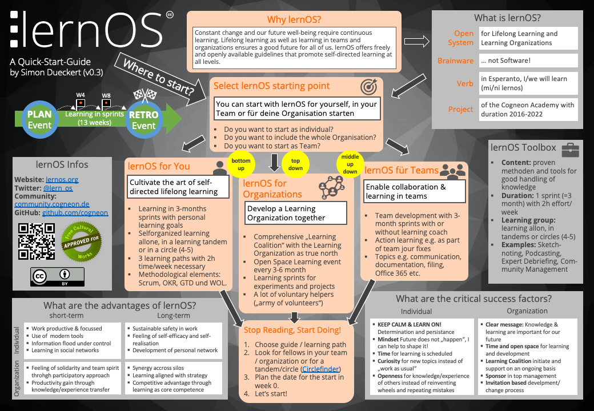

*Bahasa: [en](/lernos/en/), [de](/lernos/), id*

**Perubahan konstan** dan **kesejahteraan masa depan** kita menuntut **pembelajaran mandiri yang berkelanjutan** (lihat juga [OECD Learning Compass 2030](https://www.oecd.org/education/2030-project/contact/OECD_Learning_Compass_2030_Concept_Note_Series.pdf)). Kita semua merasakan dampak dari masyarakat berpengetahuan yang terhubung secara digital setiap hari (banjir informasi, tekanan kinerja, kecepatan inovasi teknis).

**lernOS** adalah sebuah [sistem terbuka](https://en.wikipedia.org/wiki/Open_system_(systems_theory)) untuk [pembelajaran seumur hidup](https://id.wikipedia.org/wiki/Pendidikan_seumur_hidup) dan pengembangan [organisasi pembelajar](https://id.wikipedia.org/wiki/Organisasi_pembelajar). Cara kerja lernOS dijelaskan dalam **panduan** yang tersedia secara [terbuka](https://opendefinition.org/od/2.1/de/). Anda dapat mempelajari lernOS melalui **panduan** yang tersedia secara terbuka tersebut baik sebagai **individu**, dalam **tandem belajar**, maupun **kelompok belajar** (lernOS Circle, 4-5 orang).

**Panduan Singkat lernOS (lernOS Quick-Start-Guide)** memberikan pengenalan cepat tentang topik dan konsep terpenting dari lernOS (Unduh sebagai [PDF](./downloads/lernOS-Quick-Start-Guide-en-v03.pdf), [PPT](./downloads/lernOS-Quick-Start-Guide-en-v03.pptx) - *saat ini dalam bahasa Inggris/Jerman*). Dengan **[Presentasi Web lernOS](https://cogneon.github.io/lernos/presentation/id/)**, Anda dapat dengan mudah mempresentasikan lernOS di acara, barcamp, meetup, konferensi, pertemuan departemen, pertemuan rutin, dll.

# Panduan lernOS
**Inti lernOS (lernOS Core)** menyediakan panduan pada tingkat individu, tim, dan organisasi. **Kotak Perkakas lernOS (lernOS Toolbox)** menyediakan panduan lebih lanjut tentang alat dan metode yang terbukti mendukung praktik manajemen pengetahuan yang baik. Konten lernOS dapat diunduh dalam berbagai format dan bahasa. Saat ini tersedia:

|                              | Deskripsi                                                    | Web                                                          | PDF                                                          | DOCX                                                         | MOBI                                                         | EPUB                                                         | HTML                                                         |
| ---------------------------- | ------------------------------------------------------------ | ------------------------------------------------------------ | ------------------------------------------------------------ | ------------------------------------------------------------ | ------------------------------------------------------------ | ------------------------------------------------------------ | ------------------------------------------------------------ |
| **Inti lernOS**              |                                                              |                                                              |                                                              |                                                              |                                                              |                                                              |                                                              |
| lernOS untuk Anda            | Seni pembelajaran mandiri dan seumur hidup                  | [id](https://cogneon.github.io/lernos/id/)                   | [de](https://raw.githubusercontent.com/cogneon/lernos-for-you/master/de/lernOS-fuer-Dich-Leitfaden.pdf) | [de](https://raw.githubusercontent.com/cogneon/lernos-for-you/master/de/lernOS-fuer-Dich-Leitfaden.docx) | [de](https://raw.githubusercontent.com/cogneon/lernos-for-you/master/de/lernOS-fuer-Dich-Leitfaden.mobi) | [de](https://raw.githubusercontent.com/cogneon/lernos-for-you/master/de/lernOS-fuer-Dich-Leitfaden.epub) | [de](https://github.com/cogneon/lernos-for-you/raw/master/de/lernOS-fuer-Dich-Leitfaden.html) |
| lernOS untuk Tim             | (belum tersedia)                                             |                                                              |                                                              |                                                              |                                                              |                                                              |                                                              |
| lernOS untuk Organisasi      | Bersama-sama mengembangkan Organisasi Pembelajar             | [id](https://cogneon.github.io/lernos/id/lernos-for-organizations/) | [de](https://raw.githubusercontent.com/cogneon/lernos-for-organizations/master/de/lernOS-Guide-for-Organizations-de.pdf) | [de](https://github.com/cogneon/lernos-for-organizations/raw/master/de/lernOS-Guide-for-Organizations-de.docx) | [de](https://github.com/cogneon/lernos-for-organizations/raw/master/de/lernOS-Guide-for-Organizations-de.mobi) | [de](https://github.com/cogneon/lernos-for-organizations/raw/master/de/lernOS-Guide-for-Organizations-de.epub) | [de](https://github.com/cogneon/lernos-for-organizations/raw/master/de/lernOS-Guide-for-Organizations-de.html) |
| **Kotak Perkakas lernOS**    |                                                              |                                                              |                                                              |                                                              |                                                              |                                                              |                                                              |
| Mindfulness 4.2              | Jalan Anda adalah tujuannya                                  | [de](https://cogneon.github.io/lernos-achtsamkeit/de/)       | [de](https://github.com/cogneon/lernos-achtsamkeit/blob/master/de/lernOS-Achtsamkeit42.pdf) | [de](https://github.com/cogneon/lernos-achtsamkeit/raw/develop/de/lernOS-Achtsamkeit42.docx) |                                                              |                                                              | [de](https://github.com/cogneon/lernos-achtsamkeit/raw/develop/de/lernOS-Achtsamkeit42.html) |
| BarCamp                      | KAMI membawa Struktur, ANDA membawa Konten!                  | [de](https://cogneon.github.io/lernos-barcamp/de/)           | [de](https://raw.githubusercontent.com/cogneon/lernos-barcamp/master/de/lernOS-Barcamp-Guide-de.pdf) | [de](https://github.com/cogneon/lernos-barcamp/raw/master/de/lernOS-Barcamp-Guide-de.docx) | [de](https://github.com/cogneon/lernos-barcamp/raw/master/de/lernOS-Barcamp-Guide-de.mobi) | [de](https://github.com/cogneon/lernos-barcamp/raw/master/de/lernOS-Barcamp-Guide-de.epub) | [de](https://github.com/cogneon/lernos-barcamp/raw/master/de/lernOS-Barcamp-Guide-de.html) |
| Community Management         | Pembelajaran sosial dalam jaringan                           | [de](https://cogneon.github.io/lernos-cmgmt/de/)             | [de](https://raw.githubusercontent.com/cogneon/lernos-cmgmt/master/de/lernOS-Community-Management-Guide-de.pdf) | [de](https://github.com/cogneon/lernos-cmgmt/raw/master/de/lernOS-Community-Management-Guide-de.docx) | [de](https://github.com/cogneon/lernos-cmgmt/raw/master/de/lernOS-Community-Management-Guide-de.mobi) | [de](https://github.com/cogneon/lernos-cmgmt/raw/master/de/lernOS-Community-Management-Guide-de.epub) | [de](https://github.com/cogneon/lernos-cmgmt/raw/master/de/lernOS-Community-Management-Guide-de.html) |
| Diversity & Inclusion        | Perjalanan belajar Anda dari keberagaman ke inklusi          | [de](https://cogneon.github.io/lernos-diversity/de/), [en](https://cogneon.github.io/lernos-diversity/en/) | [de](https://github.com/cogneon/lernos-diversity/blob/master/de/LernOS-Diversity-Inclusion.pdf), [en](https://github.com/cogneon/lernos-diversity/blob/master/en/LernOS-Diversity-Inclusion.pdf) | [de](https://github.com/cogneon/lernos-diversity/blob/master/de/LernOS-Diversity-Inclusion.docx), [en](https://github.com/cogneon/lernos-diversity/blob/master/en/LernOS-Diversity-Inclusion.docx) | [de](https://github.com/cogneon/lernos-diversity/blob/master/de/LernOS-Diversity-Inclusion.mobi), [en](https://github.com/cogneon/lernos-diversity/blob/master/en/LernOS-Diversity-Inclusion.mobi) | [de](https://github.com/cogneon/lernos-diversity/blob/master/de/LernOS-Diversity-Inclusion.epub), [en](https://github.com/cogneon/lernos-diversity/blob/master/en/LernOS-Diversity-Inclusion.epub) | [de](https://github.com/cogneon/lernos-diversity/blob/master/de/LernOS-Diversity-Inclusion.html), [en](https://github.com/cogneon/lernos-diversity/blob/master/en/LernOS-Diversity-Inclusion.html) |

Jika Anda memulai sebagai individu, kami menyarankan Anda untuk memulai bersama dalam sebuah **Circle** (4-5 orang) atau setidaknya dalam **tandem belajar** (2 orang). Anda dapat dengan mudah menemukan orang-orang yang berpikiran sama di [lernOS Community CONNECT](https://community.cogneon.de), di mana Anda juga dapat menemukan [lernOS Circlefinder](https://community.cogneon.de/c/lernos/lernos-circlefinder/).

Di CONNECT terdapat [gambaran umum narahubung](https://community.cogneon.de/t/lernos-ansprechpartner/1845) dan panduan/jalur pembelajaran lainnya yang sedang dikerjakan.

# FAQ lernOS

**Saya ingin mencoba lernOS, tetapi tidak tahu persis bagaimana memulainya. Tips apa yang Anda miliki?**

Tempat yang baik untuk memulai adalah [Community CONNECT](https://cogneon.de) dengan lebih dari 1.600 anggota. Anda juga dapat bertanya di media sosial seperti Twitter atau LinkedIn (tagar: #lernos). Jika Anda ingin memulai lernOS Circle, kami merekomendasikan penggunaan [Peerfinder](https://web.peerfinder.app/).

**Di mana saya dapat menemukan file DOCX, HTML, MOBI, dan EPUB untuk panduan?**

Dalam versi web panduan, klik tautan ke repositori GitHub di sudut kanan atas. Di sana Anda akan menemukan file-file tersebut di folder versi bahasa yang bersangkutan (misalnya de, en).

**Dapatkah saya membaca panduan lernOS di e-book reader seperti Kindle?**

Ya, di GitHub, panduan tersedia dalam format [EPUB](https://id.wikipedia.org/wiki/EPUB) dan [Mobipocket](https://id.wikipedia.org/wiki/Mobipocket). Misal di Kindle Anda hanya perlu mengirim file mobi ke alamat email Kindle (ditampilkan di pengaturan). Untuk perangkat lunak manajemen e-book seperti [Calibre](https://calibre-ebook.com/), Anda cukup drag and drop file epub untuk menambahkannya.

**Dapatkah saya menggunakan dan memodifikasi konten lernOS?**

Ya, Anda bisa dan kami bahkan menginginkan Anda melakukan itu! Untuk alasan ini lernOS dirilis di bawah Lisensi Creative Commons [CC BY 4.0](https://creativecommons.org/licenses/by/4.0/). Anda dapat mengunduh, menggunakan, dan memodifikasi konten tersebut. Anda dapat menggunakan konten lernOS dalam konteks pribadi maupun komersial.

**Dapatkah saya menawarkan produk dan layanan komersial dengan nama lernOS?**

Tidak. Produk dan layanan individual tidak boleh mengandung istilah "lernOS" dalam namanya (misalnya "lernOS Lernwerkstatt"). Ini seperti Browser Web Open Source [Chromium](https://www.chromium.org/Home), yang kode sumbernya dapat digunakan oleh siapa saja. Produk yang didasarkan padanya harus memiliki nama yang berbeda ([Google Chrome](https://id.wikipedia.org/wiki/Google_Chrome), [Microsoft Edge](https://id.wikipedia.org/wiki/Microsoft_Edge), [Opera](https://id.wikipedia.org/wiki/Opera_(browser)), [Flock](https://id.wikipedia.org/wiki/Flock_(web_browser)), [Brave](https://id.wikipedia.org/wiki/Brave_(web_browser))).

# Video, Podcast, Blog dll.

lernOS telah dibahas dalam banyak kuliah, diskusi, podcast, blog dll. Pilihan kecil:

* Presentasi [lernOS - Hacking How We Learn - Lifelong](https://www.youtube.com/watch?v=7atMXYyzkBc&t=16s)
* Bab **lernOS als Betriebssystem für die Arbeit der Zukunft** oleh Simon Dückert dalam [Faszination New Work: 50 Impulse für die neue Arbeitswelt](https://amzn.to/3issdMx) (de)
* Podcast [Lebenslanges Lernen mit lernOS](https://fyyd.de/episode/5173375) di Podcast Klartext HR (de)
* Presentasi [lernOS – Lebenslanges Lernen und Aufbau digitaler Kompetenzen für alle Bürger](https://www.youtube.com/watch?v=Wfe7HsqvqrQ) (de)
* Presentasi [lernOS in a Nutshell bei der GfWM Regionalgruppe Frankfurt-Rhein-Main](https://www.youtube.com/watch?v=F5-f61GvXE4) (de)
* Presentasi [Learning Organization - State of the Union - von lernOS, GTD, OKR, PKM, WOL & Co.](https://www.youtube.com/watch?v=H3O3eAY7XrI) (de)
* [lernOS All Stars Camp 2020](https://wiki.cogneon.de/loscamp20) (de)
* [lernOS Rockstars Camp 2019](https://community.cogneon.de/t/1-lernos-rockstars-camp/) (de)
* Blog [Die 13 wichtigsten Unterschiede zwischen lernOS und WOL](https://cogneon.de/2019/07/13/di3-13-wichtigsten-unterschiede-zwischen-lernos-und-wol/) (de)
* Podcast [lernOS on Air](https://cogneon.de/loa) (de)
* Video tentang lernOS untuk Anda [di LinkedIn](https://www.linkedin.com/posts/theresa-laudenbach-4559a5200_lernos-lebenslangeslernen-fau-ugcPost-6770754811093684224-uIA8) (de)

# Lisensi
lernOS tersedia sebagai [karya budaya bebas](https://creativecommons.org/share-your-work/public-domain/freeworks/) di bawah [Lisensi Internasional Creative Commons Attribution 4.0](https://creativecommons.org/licenses/by/4.0/) (CC BY). Menurut [Definisi Terbuka](https://opendefinition.org/od/2.1/de/) Anda dapat dengan bebas mengakses, memodifikasi, dan membagikan konten tersebut.

