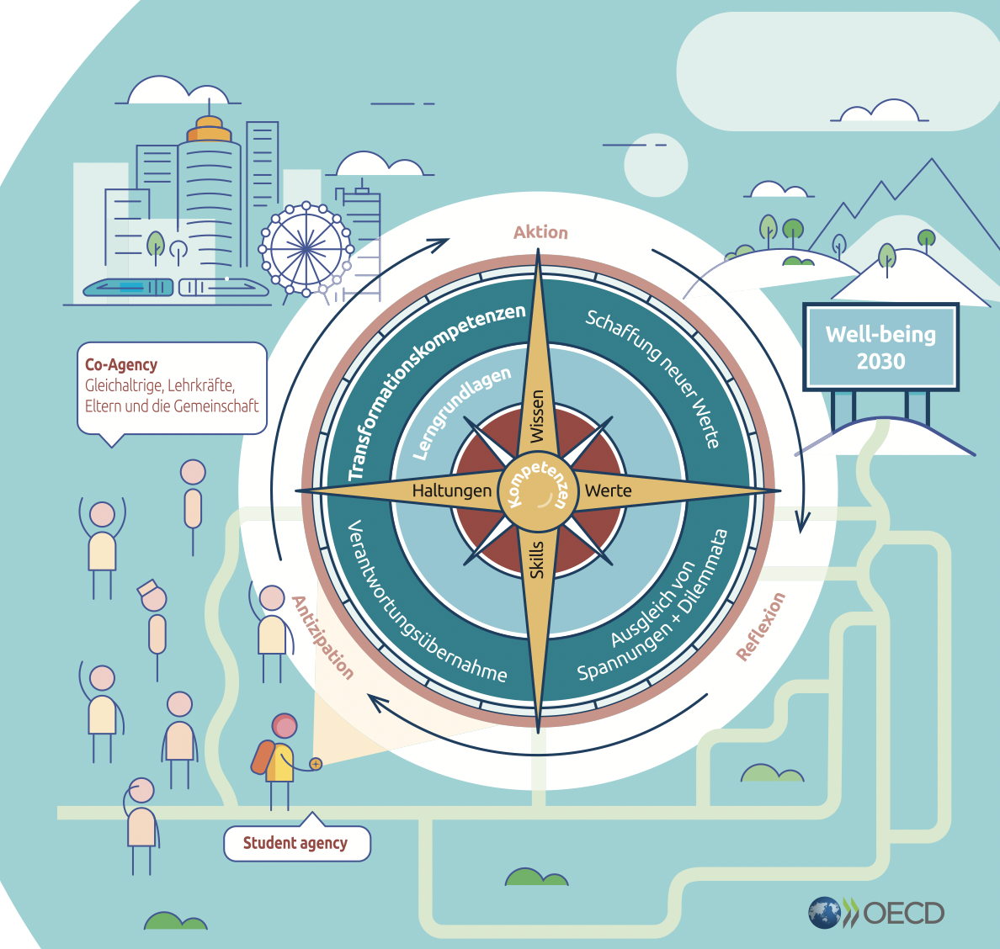

*Language: [en](/lernos/en), de*

**Ständige Veränderung** und unser **zukünftiges Wohlergehen** erfordern **kontinuierliches, selbstorganisiertes Lernen**. Lebenslanges Lernen sowie das Lernen in Teams und Organisationen sichern uns allen eine gute Zukunft (s.a. [OECD Learning Compass 2030](https://www.oecd.org/education/2030-project/contact/OECD_Lernkompass_2030.pdf)):

**lernOS** ist ein [offenes System](https://de.wikipedia.org/wiki/Offenes_System) für [Lebenslanges Lernen](https://de.wikipedia.org/wiki/Lebenslanges_Lernen) und [Lernende Organisationen](https://de.wikipedia.org/wiki/Lernende_Organisation). Die Funktionsweise von lernOS wird in [offen](https://opendefinition.org/od/2.1/de/) verfügbaren **Leitfäden** beschrieben. lernOS kann ganz einfach als **Einzelperson**, im **Team** oder in der gesamten **Organisation** praktiziert werden.

Mit lernOS ist es wie mit [den blinden Männern und dem Elefant](https://de.wikipedia.org/wiki/Die_blinden_M%C3%A4nner_und_der_Elefant): aus verschiedenen Blickwinkeln betrachtet, bedeutet lernOS unterschiedliche Dinge. Die wichtigsten Blickwinkel sind:

* Offenes System für Lebenslanges Lernen und Lernende Organisationen
* Brainware ... keine Software!
* Verb in Esperanto, ich/wir werden lernen (mi/ni lernos)
* Projekt der [Cogneon Akademie](https://lernos.org) mit Laufzeit 2016-2022
* Sammlung von offen verfügbaren Leitfäden

Der **lernOS Quick-Start-Guide** ermöglicht den schnellen Einstieg ins Thema und die wichtigsten Konzepte von lernOS (Download als [PDF](./downloads/lernOS-Quick-Start-Guide-de-v03.pdf), [PPT](./downloads/lernOS-Quick-Start-Guide-de-v03.pptx)). Mit der **[lernOS Web-Präsentation](https://cogneon.github.io/lernos/presentation/de/)** kann man lernOS ganz einfach auf Veranstaltungen, Barcamps, Meetups, Konferenzen, Abteilungsrunden, Regelterminen etc. vorstellen.

# lernOS Leitfäden

Der **lernOS Core** stellt Leitfäden auf den Ebenen Individuum, Team und Organisation bereit. The **lernOS Toolbox** provides further guides to proven tools and methods that promote good knowledge management practices. Die lernOS Inhalte können in verschiedenen Formaten und Sprachen heruntergeladen werden. Aktuell verfügbar:

|                           | Kurzbeschreibung                                             | Web                                                          | PDF                                                          | DOCX                                                         | MOBI                                                         | EPUB                                                         | HTML                                                         |
| ------------------------- | ------------------------------------------------------------ | ------------------------------------------------------------ | ------------------------------------------------------------ | ------------------------------------------------------------ | ------------------------------------------------------------ | ------------------------------------------------------------ | ------------------------------------------------------------ |
| **lernOS Core**           |                                                              |                                                              |                                                              |                                                              |                                                              |                                                              |                                                              |
| lernOS für Dich           | Die Kunst des selbstgesteuerten, lebenslangenen Lernens      | [de](https://cogneon.github.io/lernos-for-you/de/)           | [de](https://raw.githubusercontent.com/cogneon/lernos-for-you/master/de/lernOS-fuer-Dich-Leitfaden.pdf) | [de](https://raw.githubusercontent.com/cogneon/lernos-for-you/master/de/lernOS-fuer-Dich-Leitfaden.docx) | [de](https://raw.githubusercontent.com/cogneon/lernos-for-you/master/de/lernOS-fuer-Dich-Leitfaden.mobi) | [de](https://raw.githubusercontent.com/cogneon/lernos-for-you/master/de/lernOS-fuer-Dich-Leitfaden.epub) | [de](https://github.com/cogneon/lernos-for-you/raw/master/de/lernOS-fuer-Dich-Leitfaden.html) |
| lernOS für Teams          | (noch nicht verfügbar)                                       |                                                              |                                                              |                                                              |                                                              |                                                              |                                                              |
| lernOS für Organisationen | Gemeinsam Lernende Organisationen entwickeln                 | [de](https://cogneon.github.io/lernos-for-organizations/de/) | [de](https://raw.githubusercontent.com/cogneon/lernos-for-organizations/master/de/lernOS-Guide-for-Organizations-de.pdf) | [de](https://github.com/cogneon/lernos-for-organizations/raw/master/de/lernOS-Guide-for-Organizations-de.docx) | [de](https://github.com/cogneon/lernos-for-organizations/raw/master/de/lernOS-Guide-for-Organizations-de.mobi) | [de](https://github.com/cogneon/lernos-for-organizations/raw/master/de/lernOS-Guide-for-Organizations-de.epub) | [de](https://github.com/cogneon/lernos-for-organizations/raw/master/de/lernOS-Guide-for-Organizations-de.html) |
| **lernOS Toolbox**        |                                                              |                                                              |                                                              |                                                              |                                                              |                                                              |                                                              |
| Achtsamkeit 4.2           | Dein Weg ist das Ziel                                        | [de](https://cogneon.github.io/lernos-achtsamkeit/de/)       | [de](https://github.com/cogneon/lernos-achtsamkeit/blob/master/de/lernOS-Achtsamkeit42.pdf) | [de](https://github.com/cogneon/lernos-achtsamkeit/raw/develop/de/lernOS-Achtsamkeit42.docx) |                                                              |                                                              | [de](https://github.com/cogneon/lernos-achtsamkeit/raw/develop/de/lernOS-Achtsamkeit42.html) |
| BarCamp                   | WE bring the Structure, YOU bring the Content!               | [de](https://cogneon.github.io/lernos-barcamp/de/)           | [de](https://raw.githubusercontent.com/cogneon/lernos-barcamp/master/de/lernOS-Barcamp-Guide-de.pdf) | [de](https://github.com/cogneon/lernos-barcamp/raw/master/de/lernOS-Barcamp-Guide-de.docx) | [de](https://github.com/cogneon/lernos-barcamp/raw/master/de/lernOS-Barcamp-Guide-de.mobi) | [de](https://github.com/cogneon/lernos-barcamp/raw/master/de/lernOS-Barcamp-Guide-de.epub) | [de](https://github.com/cogneon/lernos-barcamp/raw/master/de/lernOS-Barcamp-Guide-de.html) |
| Community Management      | Soziales Lernen im Netzwerk                                  | [de](https://cogneon.github.io/lernos-cmgmt/de/)             | [de](https://raw.githubusercontent.com/cogneon/lernos-cmgmt/master/de/lernOS-Community-Management-Guide-de.pdf) | [de](https://github.com/cogneon/lernos-cmgmt/raw/master/de/lernOS-Community-Management-Guide-de.docx) | [de](https://github.com/cogneon/lernos-cmgmt/raw/master/de/lernOS-Community-Management-Guide-de.mobi) | [de](https://github.com/cogneon/lernos-cmgmt/raw/master/de/lernOS-Community-Management-Guide-de.epub) | [de](https://github.com/cogneon/lernos-cmgmt/raw/master/de/lernOS-Community-Management-Guide-de.html) |
| Expert Debriefing         |                                                              | [de](https://cogneon.github.io/lernos-expert-debriefing/de/) | [de](https://raw.githubusercontent.com/cogneon/lernos-expert-debriefing/master/de/lernOS-expert-debriefing-Guide-de.pdf) | [de](https://github.com/cogneon/lernos-expert-debriefing/raw/master/de/lernOS-expert-debriefing-Guide-de.docx) | [de](https://github.com/cogneon/lernos-expert-debriefing/raw/master/de/lernOS-expert-debriefing-Guide-de.mobi) | [de](https://github.com/cogneon/lernos-expert-debriefing/raw/master/de/lernOS-expert-debriefing-Guide-de.epub) | [de](https://github.com/cogneon/lernos-expert-debriefing/raw/master/de/lernOS-expert-debriefing-Guide-de.html) |
| Podcasting                | Wissen teilen mit Podcasts                                   | [de](https://cogneon.github.io/lernos-podcasting/de/)        | [de](https://raw.githubusercontent.com/cogneon/lernos-podcasting/master/de/lernOS-Podcasting-Guide-de.pdf) | [de](https://github.com/cogneon/lernos-podcasting/raw/master/de/lernOS-Podcasting-Guide-de.docx) | [de](https://github.com/cogneon/lernos-podcasting/raw/master/de/lernOS-Podcasting-Guide-de.mobi) | [de](https://github.com/cogneon/lernos-podcasting/raw/master/de/lernOS-Podcasting-Guide-de.epub) | [de](https://github.com/cogneon/lernos-podcasting/raw/master/de/lernOS-Podcasting-Guide-de.html) |
| Prozessmodellierung       | If you can’t describe what you are doing as a process,you don’t know what you’re doing |                                                              | [de](https://github.com/cogneon/lernos-prozessmodellierung/releases/download/1.0/lernOS-Prozessmodellierung-de.pdf) |                                                              |                                                              |                                                              |                                                              |
| Sketchnoting              |                                                              | [de](https://cogneon.github.io/lernos-sketchnoting/de/), [en](https://cogneon.github.io/lernos-sketchnoting/en/) | [de](https://raw.githubusercontent.com/cogneon/lernos-sketchnoting/master/de/lernOS-Sketchnoting-Guide-de.pdf), [en](https://github.com/cogneon/lernos-sketchnoting/raw/master/en/lernOS-Sketchnoting-Guide-en.pdf) | [de](https://github.com/cogneon/lernos-sketchnoting/raw/master/de/lernOS-Sketchnoting-Guide-de.docx), [en](https://github.com/cogneon/lernos-sketchnoting/raw/master/en/lernOS-Sketchnoting-Guide-en.docx) | [de](https://github.com/cogneon/lernos-sketchnoting/raw/master/de/lernOS-Sketchnoting-Guide-de.mobi), [en](https://github.com/cogneon/lernos-sketchnoting/raw/master/en/lernOS-Sketchnoting-Guide-en.mobi) | [de](https://github.com/cogneon/lernos-sketchnoting/raw/master/de/lernOS-Sketchnoting-Guide-de.epub), [en](https://github.com/cogneon/lernos-sketchnoting/raw/master/en/lernOS-Sketchnoting-Guide-en.epub) | [de](https://github.com/cogneon/lernos-sketchnoting/raw/master/de/lernOS-Sketchnoting-Guide-de.html), [en](https://github.com/cogneon/lernos-sketchnoting/raw/master/en/lernOS-Sketchnoting-Guide-en.html) |

Startest du als Einzelperson, empfehlen wir dir, gemeinsam in einem **Circle** (4-5 Personen) oder zumindest in einem **Lerntandem** (2 Personen) zu starten. Mitstreiter findest du ganz einfach in der [lernOS Community CONNECT](https://community.cogneon.de), dort gibt es z.B. den [lernOS Circlefinder](https://community.cogneon.de/c/lernos/lernos-circlefinder/).

# Videos, Podcasts, Blogs etc.

lernOS wurde bereits in vielen Vorträgen, Diskussionen, Podcasts, Blogs etc. besprochen. Eine kleine Auswahl:

* Buchkapitel **lernOS als Betriebssystem für die Arbeit der Zukunft** von Simon Dückert in [Faszination New Work: 50 Impulse für die neue Arbeitswelt](https://amzn.to/3issdMx)
* Podcast [Lebenslanges Lernen mit lernOS](https://fyyd.de/episode/5173375) im Klartext HR Podcast
* Vortrag [lernOS – Lebenslanges Lernen und Aufbau digitaler Kompetenzen für alle Bürger](https://www.youtube.com/watch?v=Wfe7HsqvqrQ)
* Vortrag [lernOS in a Nutshell bei der GfWM Regionalgruppe Frankfurt-Rhein-Main](https://www.youtube.com/watch?v=F5-f61GvXE4)
* Vortrag [Learning Organization - State of the Union - von lernOS, GTD, OKR, PKM, WOL & Co.](https://www.youtube.com/watch?v=H3O3eAY7XrI)
* Vortrag [lernOS - Hacking How We Learn - Lifelong](https://www.youtube.com/watch?v=7atMXYyzkBc&t=16s) (en)
* [lernOS All Stars Camp 2020](https://wiki.cogneon.de/loscamp20)
* [lernOS Rockstars Camp 2019](https://community.cogneon.de/t/1-lernos-rockstars-camp/)
* Blog [Die 13 wichtigsten Unterschiede zwischen lernOS und WOL](https://cogneon.de/2019/07/13/di3-13-wichtigsten-unterschiede-zwischen-lernos-und-wol/)
* Podcast [lernOS on Air](https://cogneon.de/loa)
* [lernOS Community Call](https://www.youtube.com/watch?v=-YKT2dD_C10&list=PLsDEDkLIwmRytb196veslnu2JiK9_dTqy) (Erster Freitag im Monat)

# Lizenz

lernOS ist als [free cultural work](https://creativecommons.org/share-your-work/public-domain/freeworks/) unter [Creative Commons Attribution 4.0 International License](https://creativecommons.org/licenses/by/4.0/) (CC BY) verfügbar. Gemäß der [Open Definition](https://opendefinition.org/od/2.1/de/) kannst du die Inhalte frei zugreifen, verändern und teilen.

# lernOS FAQ
**Wo finde ich die DOCX-, HTML-, MOBI- und EPUB-Dateien zu den Leitfäden?**

Klicke in der Web-Version des Leitfadens oben rechts auf den Link zum GitHub-Repository. Dort findest du die Dateien im Ordner zur jeweiligen Sprachversion (z.B. de, en).

**Kann ich die lernOS Leitfäden auf einem E-Book-Reader wie dem Kindle lesen?**

Ja, auf GitHub sind die Leitfaden in den E-Book-Formaten [EPUB](https://de.wikipedia.org/wiki/EPUB) und [Mobipocket](https://de.wikipedia.org/wiki/Mobipocket) verfügbar. Beim Kindle musst du z.B. die mobi-Datei an die E-Mail-Adresse des Kindle schicken (wird in den Einstellungen angezeigt). Bei E-Book-Management-Software wie [Calibre](https://calibre-ebook.com/) kann die epub-Datei einfach per Drag&Drop hinzugefügt werden.

**Kann ich lernOS Inhalte benutzen und modifizieren?**

Ja, du kannst und wir wollen sogar, dass du das machst! Aus diesem Grund wird lernOS unter der Creative-Commons-Lizenz [CC BY 4.0](https://creativecommons.org/licenses/by/4.0/) veröffentlicht. Du kannst die Inhalte herunterladen, benutzen und modifizieren. Du kannst lernOS Inhalte im privaten und kommerziellen Kontexten verwenden.

**Kann ich kommerzielle Produkte und Dienstleistungen mit lernOS im Namen anbieten?**

Nein. Einzelne Produkte und Dienstleistungen dürfen den Begriff "lernOS" nicht in ihrem Namen enthalten (z.B. "lernOS Lernwerkstatt"). Das ist wie bei Open Source Webbrowser [Chromium](https://www.chromium.org/Home), dessen Quellcode jeder verwenden kann. Darauf aufbauende Produkte müssen aber einen anderen Namen haben ([Google Chrome](https://de.wikipedia.org/wiki/Google_Chrome), [Microsoft Edge](https://de.wikipedia.org/wiki/Microsoft_Edge), [Opera](https://de.wikipedia.org/wiki/Opera_(Browser)), [Flock](https://de.wikipedia.org/wiki/Flock_(Browser)), [Brave](https://de.wikipedia.org/wiki/Brave_(Browser))).

